# CLAUDE.md

This file provides guidance to Claude Code (claude.ai/code) when working with code in this
repository.

## 개요

**Puppy Talk**은 생성형 AI 기반 반려동물 채팅 서비스의 백엔드 서버입니다. Java Spring Boot 멀티모듈 프로젝트로 **Layered
Architecture** 패턴을 기반으로 설계되었습니다.

### 핵심 비즈니스 기능

- **반려동물 생성**: 페르소나 기반 가상 반려동물 생성 (1Pet = 1Persona, 수정불가)
- **실시간 채팅**: 사용자와 AI 반려동물 간 1:1 채팅 (1Pet = 1ChatRoom)
- **활동 기반 알림**: 마지막 활동으로부터 2시간 경과 시 반려동물이 먼저 메시지 전송

## 주요 개발 명령어

### 빌드 및 실행

```bash
# 전체 프로젝트 빌드
./gradlew clean build

# 애플리케이션 실행 (local 프로필)
./gradlew application-api:bootRun

# 특정 모듈 빌드
./gradlew {module-name}:build

# 전체 테스트 실행
./gradlew test

# 특정 모듈 테스트
./gradlew {module-name}:test

# JAR 파일 빌드
./gradlew application-api:bootJar
```

### Docker 환경

```bash
# 개발용: MySQL만 Docker로 실행
docker-compose -f docker-compose.dev.yml up -d

# 전체 서비스 실행 (권장 방법)
./gradlew application-api:bootJar
docker-compose up -d

# 로그 확인
docker-compose logs -f

# 환경 정리
docker-compose down -v
```

### 빠른 스크립트 실행

```bash
# scripts/build.sh 사용 (MacOS/Linux)
cd scripts && sh build.sh

# 단일 테스트 실행
./gradlew {module-name}:test --tests {TestClassName}

# 특정 테스트 메서드 실행  
./gradlew {module-name}:test --tests {TestClassName}.{methodName}
```

## Layered Architecture 구조

### 핵심 아키텍처 원칙

1. **계층 분리**: 각 계층은 명확한 책임을 가지며 단일 관심사에 집중
2. **단방향 의존성**: 상위 계층만 하위 계층을 의존 (역방향 의존 금지)
3. **의존성 역전**: 상위 계층은 하위 계층의 추상화(인터페이스)에 의존
4. **계층별 응집도**: 같은 계층 내 모듈들은 유사한 책임과 추상화 수준

### 계층별 역할 (상위 → 하위)

**Application Layer (애플리케이션 계층)**

- `application-api/`: Spring Boot 애플리케이션 부트스트랩, 전체 시스템 조립

**Presentation Layer (프레젠테이션 계층)**

- `api/`: REST API 컨트롤러, DTO, 외부 요청 처리 및 응답 변환

**Business Logic Layer (비즈니스 로직 계층)**

- `service/`: 핵심 비즈니스 로직, 유스케이스 구현
- `ai-service/`: AI 제공업체 통합 서비스
- `push-service/`: 푸시 알림 서비스

**Data Access Layer (데이터 접근 계층)**

- `infrastructure/`: 데이터 접근 인터페이스 정의 (Repository 인터페이스)
- `repository-jdbc/`: JDBC 기반 데이터 액세스 구현체

**Domain Layer (도메인 계층)**

- `model/`: 순수 도메인 엔티티 (Pet, User, Persona, ChatRoom, Message) - 외부 의존성 없음
- `exception/`: 도메인 예외 (PetNotFoundException) - model 모듈만 의존

**Infrastructure Layer (인프라스트럭처 계층)**

- `schema/`: 데이터베이스 스키마 관리 (Liquibase)

### 모듈 간 의존성 관계 (계층형)

```mermaid
flowchart TD
    %% Layered Architecture Structure
    subgraph "🚀 Application Layer"
        application["application-api<br/>Spring Boot Bootstrap"]
    end
    
    subgraph "🌐 Presentation Layer"
        api["api<br/>REST Controllers & DTOs"]
    end
    
    subgraph "🔧 Business Logic Layer"
        service["service<br/>Business Services"]
        aiService["ai-service<br/>AI Integration"]
        pushService["push-service<br/>Push Notifications"]
    end
    
    subgraph "💾 Data Access Layer"
        infrastructure["infrastructure<br/>Repository Interfaces"]
        repository["repository-jdbc<br/>JDBC Implementation"]
    end
    
    subgraph "🎯 Domain Layer"
        model["model<br/>Domain Entities"]
        exception["exception<br/>Domain Exceptions"]
    end
    
    subgraph "📊 Infrastructure Layer"
        schema["schema<br/>Database Schema"]
    end

    %% Top-down dependencies only
    application --> api
    application --> service
    application --> aiService
    application --> pushService
    application --> repository
    application --> schema
    
    api --> service
    api --> exception
    
    service --> repository
    service --> infrastructure
    service --> model
    service --> exception
    
    aiService --> model
    aiService --> exception
    
    pushService --> model
    pushService --> exception
    
    repository --> infrastructure
    repository --> model
    
    infrastructure --> model
    exception --> model

    %% Layer styling
    classDef applicationLayer fill:#fce4ec,stroke:#880e4f,stroke-width:2px
    classDef presentationLayer fill:#e8f5e8,stroke:#1b5e20,stroke-width:2px
    classDef businessLayer fill:#f3e5f5,stroke:#4a148c,stroke-width:2px
    classDef dataLayer fill:#fff3e0,stroke:#e65100,stroke-width:2px
    classDef domainLayer fill:#e1f5fe,stroke:#01579b,stroke-width:2px
    classDef infrastructureLayer fill:#f1f8e9,stroke:#33691e,stroke-width:2px
    
    class application applicationLayer
    class api presentationLayer
    class service,aiService,pushService businessLayer
    class infrastructure,repository dataLayer
    class model,exception domainLayer
    class schema infrastructureLayer
```



## 기술적 특징

### 스프링 프로필 관리

- **local**: 로컬 MySQL (localhost:3306) - 환경변수 지원
- **docker**: Docker 컨테이너 간 연결 (mysql:3306)
- **test**: H2 인메모리 데이터베이스

### 데이터베이스 스키마 관리

- Liquibase 사용 (`schema/src/main/resources/db/changelog/`)
- 상대 경로 및 논리적 파일 경로 설정으로 이식성 확보
- 변경 로그는 XML 형식으로 관리

### 데이터베이스 아키텍처

현재 구현된 핵심 테이블 구조:

- **USERS**: 사용자 관리 (username, email, password)
- **PERSONAS**: AI 페르소나 정의 (personality_traits JSON, ai_prompt_template)
- **PETS**: 가상 반려동물 (user_id → persona_id 연결)
- **CHAT_ROOMS**: 채팅방 (pet_id와 1:1 관계)
- **MESSAGES**: 채팅 메시지 (sender_type: USER/PET)
- **USER_ACTIVITIES**: 사용자 활동 추적 (MESSAGE_SENT/READ/CHAT_OPENED)
- **INACTIVITY_NOTIFICATIONS**: 비활성 알림 관리 (2시간 경과 알림)

### ID 생성 전략

- KeyHolder 사용하여 자동 생성 ID 처리
- 삽입 시 생성된 ID로 새로운 도메인 객체 반환

### 알림 시스템 아키텍처

- **활동 추적**: USER_ACTIVITIES 테이블에 모든 사용자 활동 기록
- **비활성 감지**: 마지막 활동으로부터 2시간 경과 시 INACTIVITY_NOTIFICATIONS에서 알림 트리거
- **AI 메시지 생성**: 페르소나별 맞춤형 비활성 메시지 자동 생성
- **실시간 처리**: 스케줄러가 매분 알림 대상 조회 및 메시지 발송

### Gradle 의존성 전략

- **api project**: 공개 API에서 타입 노출이 필요한 경우 (model → exception, service)
- **implementation project**: 내부 구현에서만 사용하는 경우 (나머지 모듈간)

### 모듈 간 의존성 규칙

- Domain 모듈(model, exception)은 외부 의존성 금지
- Service는 Infrastructure 인터페이스만 의존, 구현체 직접 의존 금지
- Repository 구현체는 Infrastructure 인터페이스 구현
- API 레이어는 Service와 Exception에만 의존

### 코드 작성 원칙

- DTO는 record 타입 사용
- Service 메서드에는 @Transactional(readOnly = true) 적용 (조회)
- 생성자에서 null 및 유효성 검증 수행
- Builder 패턴 사용 시에도 동일한 검증 로직 적용

### 인증 시스템 구현

- **Spring Security 사용 금지**: 프로젝트 정책에 따라 Spring Security 완전 배제
- **커스텀 BCrypt 구현**: `at.favre.lib:bcrypt:0.10.2`를 사용한 독립적인 패스워드 해싱
- **JWT 토큰 기반**: `io.jsonwebtoken:jjwt-*:0.12.3`를 사용한 토큰 인증
- **WebSocket 인증**: JWT 토큰을 통한 WebSocket 연결 인증 (WebSocketAuthInterceptor)

### 개발 시 중요 고려사항

**비즈니스 로직 구현 시:**

- 활동 기록: 모든 사용자 액션(메시지 송/수신, 채팅방 열기)을 USER_ACTIVITIES에 기록
- 알림 시스템: 비활성 2시간 후 AI가 먼저 대화 시작하는 로직 구현
- 페르소나 일관성: AI 응답이 선택된 페르소나 특성과 일치하도록 ai_prompt_template 활용

**데이터 모델링 원칙:**

- 1 사용자 → N 반려동물 (pets.user_id)
- 1 반려동물 → 1 페르소나 (pets.persona_id, 수정 불가)
- 1 반려동물 → 1 채팅방 (chat_rooms.pet_id UNIQUE)

### 컨벤션

- 패키지: `com.puppy.talk.{domain}.{layer}`
- Service: `{Domain}LookUpService`
- Repository: `{Domain}Repository` (인터페이스), `{Domain}JdbcRepository` (구현체)
- Identity: `{Domain}Identity`

## 환경 설정

### 환경변수 (local 프로필)

- `SPRING_DATASOURCE_URL`: MySQL 연결 URL (기본값: jdbc:mysql://localhost:
  3306/puppy_talk_db?useSSL=false&allowPublicKeyRetrieval=true)
- `SPRING_DATASOURCE_USERNAME`: DB 사용자명 (기본값: root)
- `SPRING_DATASOURCE_PASSWORD`: DB 패스워드 (기본값: 1234)

### API 문서화

- SpringDoc OpenAPI 사용
- `/swagger-ui.html`에서 API 문서 확인 가능

### 컨테이너 최적화

- Amazon Corretto 21 JRE 기반
- Non-root 사용자로 실행 (보안 강화)
- G1GC 및 컨테이너 최적화 JVM 옵션 적용

## AI 서비스 아키텍처

### Multi-Provider AI 시스템

이 프로젝트는 다중 AI 제공업체 지원을 통한 유연한 AI 서비스를 제공합니다:

**지원 AI 제공업체:**
- **gpt-oss**: 로컬 실행 오픈소스 모델 (무료, 빠른 응답)
- **OpenAI**: ChatGPT 시리즈 (API 키 필요)
- **Anthropic Claude**: Claude 시리즈 (API 키 필요)
- **Google Gemini**: Gemini 시리즈 (API 키 필요)

**핵심 기능:**
- 자동 대체(Fallback) 시스템: 기본 제공업체 실패 시 자동으로 대체 제공업체 사용
- 동적 제공업체 선택: 각 제공업체의 상태를 실시간 모니터링
- 비용 최적화: 무료 로컬 모델 우선 사용, 필요시에만 유료 서비스 활용

**AI 서비스 상태 확인:**
```bash
# AI 제공업체 상태 확인
curl http://localhost:8080/api/ai/providers/status
```

**모듈 구조:**
- `ai-service/`: AI 제공업체 추상화 및 관리
- `push-service/`: Firebase FCM 기반 푸시 알림

### WebSocket 실시간 채팅

- Spring WebSocket + STOMP 프로토콜 사용
- JWT 기반 WebSocket 인증 (WebSocketAuthInterceptor)
- 실시간 메시지 송수신 및 활동 추적
- 연결/해제 이벤트 모니터링 (WebSocketEventListener)

**WebSocket 엔드포인트:**
- `/ws/chat`: WebSocket 연결
- `/app/chat.sendMessage`: 메시지 송신
- `/topic/chat/{chatRoomId}`: 채팅방별 구독

### 푸시 알림 시스템

- Firebase Cloud Messaging (FCM) 기반
- 디바이스 토큰 관리 (DEVICE_TOKENS 테이블)
- 푸시 알림 이력 관리 (PUSH_NOTIFICATIONS 테이블)
- 비활성 알림과 연동된 자동 푸시 발송

## 개발 및 테스트 가이드

### HTTP 요청 테스트

프로젝트 루트의 `http-requests/` 디렉토리에 API 테스트 파일들이 있습니다:

```bash
# IntelliJ HTTP Client를 사용한 API 테스트
# http-requests/pet-management.http - 펫 관리 API
# http-requests/ai-chat-api.http - AI 채팅 API
# http-requests/ai-provider-status.http - AI 제공업체 상태 확인
```

### 테스트 실행 가이드

```bash
# 전체 테스트 실행
./gradlew test

# 특정 모듈 테스트만 실행
./gradlew service:test

# 단일 테스트 클래스 실행
./gradlew service:test --tests AuthServiceTest

# 특정 테스트 메서드만 실행
./gradlew service:test --tests "AuthServiceTest.login_ValidCredentials_Success"

# 테스트 결과 상세 출력
./gradlew test --info
```

### 추가 모듈 정보

**주요 도메인 모듈:**
- `model/`: 순수 도메인 엔티티 (User, Pet, Persona, ChatRoom, Message, UserActivity, InactivityNotification, DeviceToken, PushNotification)
- `service/`: 비즈니스 로직 구현 (인증, 채팅, 스케줄러 포함)
- `infrastructure/`: 포트 인터페이스 정의
- `repository-jdbc/`: JDBC 기반 데이터 액세스 구현

**보조 모듈:**
- `ai-service/`: AI 제공업체 관리 및 응답 생성
- `push-service/`: FCM 기반 푸시 알림  
- `schema/`: Liquibase 데이터베이스 스키마 관리

## 중요 구현 세부사항

### 인증 서비스 (`service/src/main/java/com/puppy/talk/auth/`)

- **AuthService**: 사용자 로그인/등록 처리 (Spring Security 없이 구현)
- **PasswordEncoder**: BCrypt 해싱을 위한 커스텀 구현체 
- **JwtTokenProvider**: JWT 토큰 생성/검증 (JJWT 0.12.3 API 사용)

### 테스트 구조

- **Mock 객체 직접 생성**: Mockito 대신 내부 Mock 클래스 구현
- **통합 테스트**: WebSocket과 AI 서비스를 포함한 시나리오 테스트
- **비즈니스 로직 테스트**: 각 서비스의 핵심 기능에 대한 포괄적 테스트

### 모니터링 및 운영

- **Prometheus**: `monitoring/prometheus.yml`에서 메트릭 수집 설정
- **Nginx**: 리버스 프록시 및 SSL 설정 (`nginx/`)
- **Docker Compose**: 개발/운영 환경별 설정 파일 제공