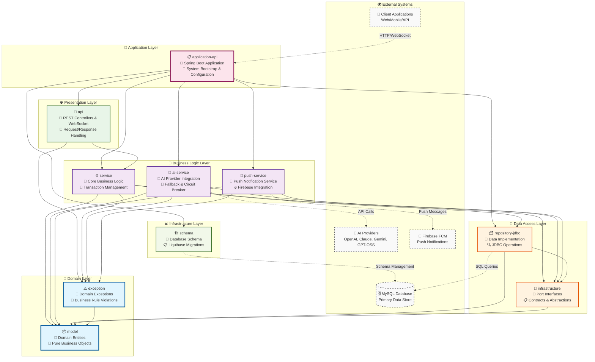
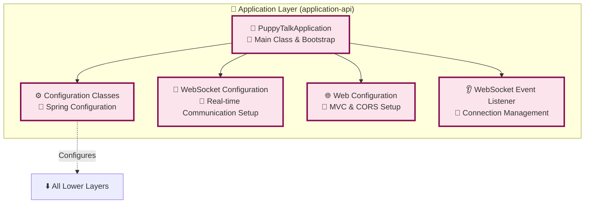
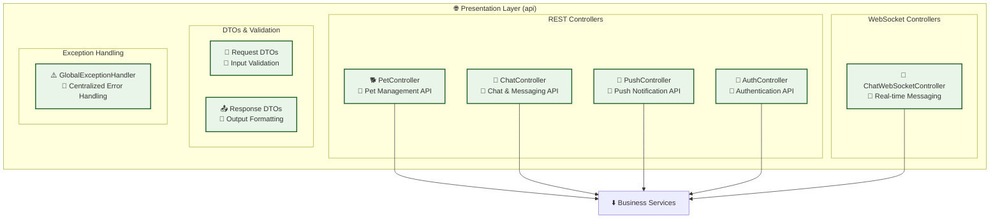
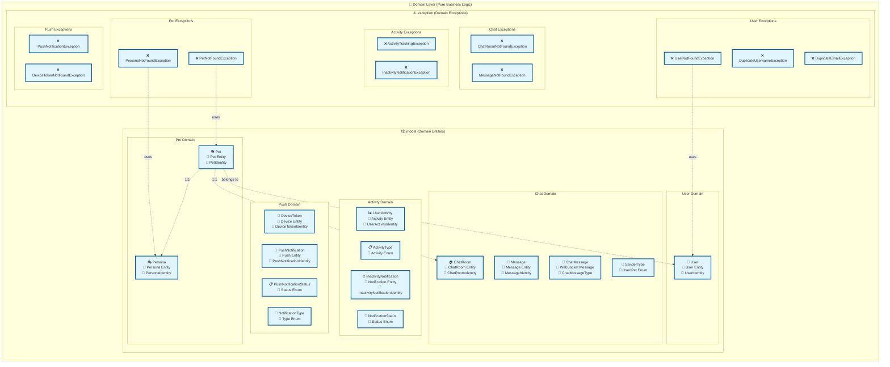
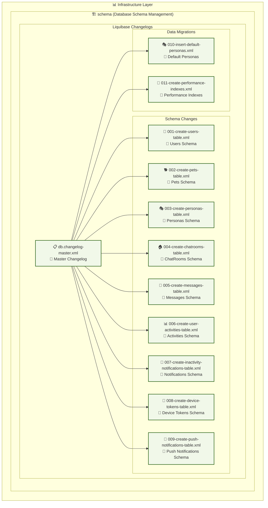
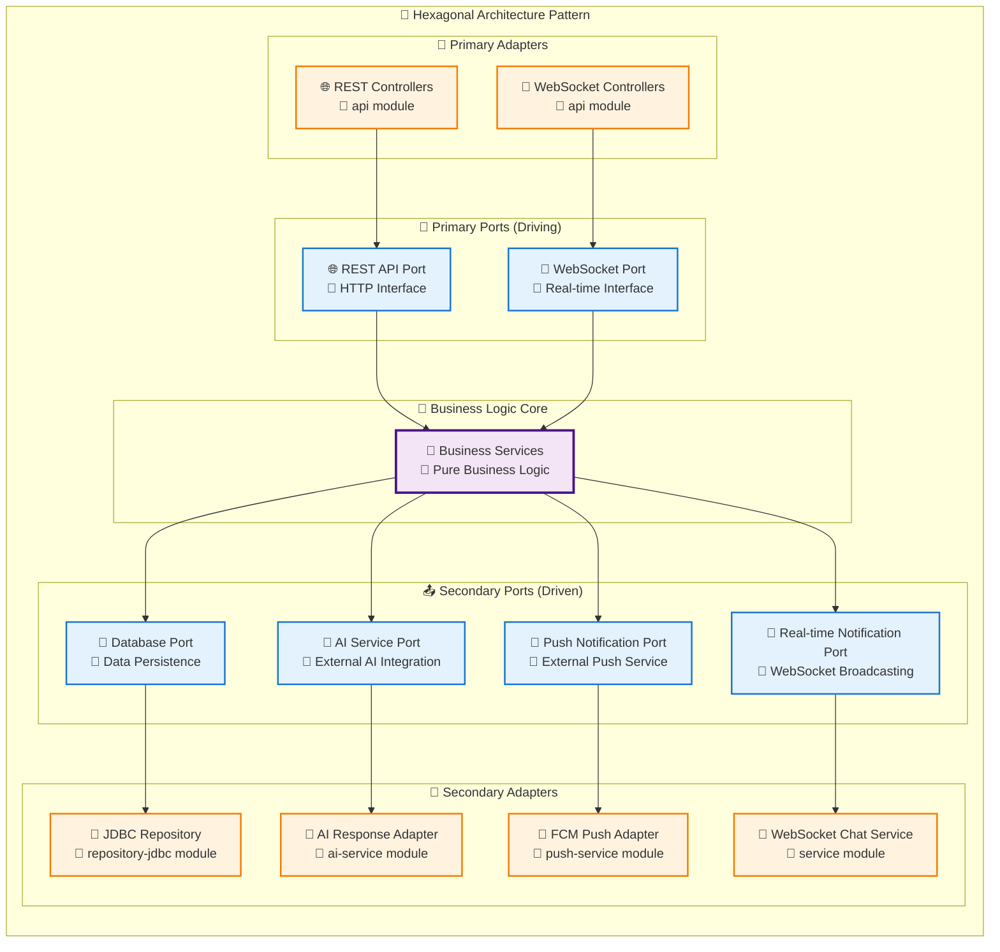
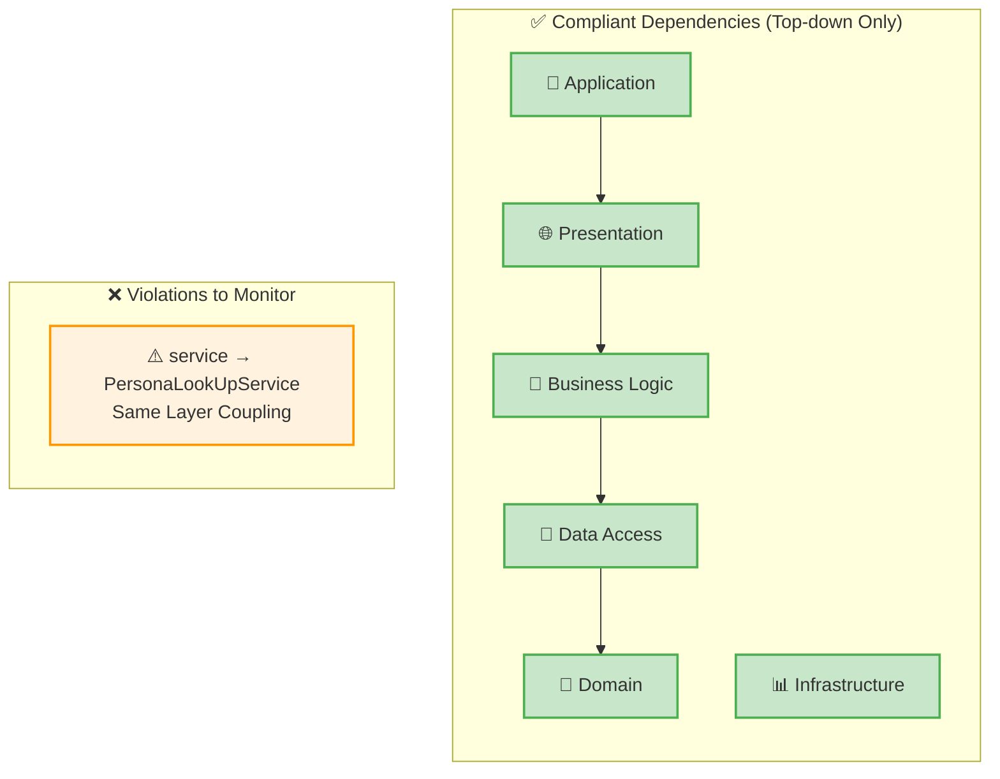

# Comprehensive Layered Architecture Diagram
## Puppy Talk Server - 포괄적 계층형 아키텍처 다이어그램

---

## 🏗️ 전체 시스템 아키텍처 (Comprehensive System Architecture)

### Master Architecture Overview



---

## 🎯 Layer-by-Layer Detailed Architecture

### 1. 🚀 Application Layer - System Bootstrap



### 2. 🌐 Presentation Layer - API Interface



### 3. 🔧 Business Logic Layer - Service Architecture

```mermaid
flowchart TB
    subgraph "🔧 Business Logic Layer"
        direction TB
        
        subgraph "📦 service (Core Business)"
            direction TB
            
            subgraph "🔐 Authentication Domain"
                auth_svc[🔐 AuthService<br/>📍 Login & Registration]
                jwt_provider[🎫 JwtTokenProvider<br/>📍 Token Management] 
                pwd_encoder[🔒 PasswordEncoder<br/>📍 Password Security]
            end
            
            subgraph "👤 User Domain" 
                user_lookup[👤 UserLookUpService<br/>📍 User Queries]
            end
            
            subgraph "🐕 Pet Domain"
                pet_reg[🐕 PetRegistrationService<br/>📍 Pet Registration]
                pet_lookup[🔍 PetLookUpService<br/>📍 Pet Queries]
                persona_lookup[🎭 PersonaLookUpService<br/>📍 Persona Management]
            end
            
            subgraph "💬 Chat Domain"
                chat_svc[💬 ChatService<br/>📍 Chat Business Logic]
                msg_lookup[📨 MessageLookUpService<br/>📍 Message Queries]
                chatroom_lookup[🏠 ChatRoomLookUpService<br/>📍 Room Management]
                activity_track[📊 ActivityTrackingService<br/>📍 User Activity Tracking]
                ws_chat_svc[🔌 WebSocketChatService<br/>📍 Real-time Chat]
                device_token_svc[📱 DeviceTokenService<br/>📍 Device Management]
            end
            
            subgraph "🔔 Notification Domain"
                inactivity_svc[⏰ InactivityNotificationService<br/>📍 Inactivity Alerts]
                inactivity_scheduler[📅 InactivityNotificationScheduler<br/>📍 Scheduled Tasks]
                push_notification_svc[📱 PushNotificationService<br/>📍 Push Management]
                push_scheduler[📅 PushNotificationScheduler<br/>📍 Push Scheduling]
                realtime_port[🔌 RealtimeNotificationPort<br/>📍 Real-time Interface]
            end
            
            subgraph "📋 Shared Components"
                shared_dto[📦 Shared DTOs<br/>📍 Cross-Domain Data]
            end
        end
        
        subgraph "🤖 ai-service (External AI Integration)"
            direction TB
            ai_adapter[🤖 AiResponseAdapter<br/>📍 AI Integration Adapter]
            ai_factory[🏭 AiProviderFactory<br/>📍 Provider Management]
            prompt_builder[📝 PromptBuilder<br/>📍 Prompt Engineering]
            
            subgraph "AI Providers"
                openai[🧠 OpenAiProvider]
                claude[🤖 ClaudeProvider] 
                gemini[✨ GeminiProvider]
                gpt_oss[🔓 GptOssProvider]
            end
        end
        
        subgraph "📱 push-service (Push Notifications)"
            direction TB
            fcm_sender[📱 FcmPushNotificationSender<br/>📍 Firebase Integration]
            firebase_config[🔥 FirebaseConfig<br/>📍 Firebase Setup]
            push_config[⚙️ PushServiceConfig<br/>📍 Service Configuration]
        end
    end

    %% Internal Business Layer Dependencies
    chat_svc --> user_lookup
    chat_svc --> pet_lookup
    inactivity_svc --> chat_svc
    
    ai_adapter --> ai_factory
    ai_factory --> openai
    ai_factory --> claude
    ai_factory --> gemini
    ai_factory --> gpt_oss
    
    fcm_sender --> firebase_config
    
    classDef business fill:#f3e5f5,stroke:#4a148c,stroke-width:2px
    class auth_svc,jwt_provider,pwd_encoder,user_lookup,pet_reg,pet_lookup,persona_lookup business
    class chat_svc,msg_lookup,chatroom_lookup,activity_track,ws_chat_svc,device_token_svc business
    class inactivity_svc,inactivity_scheduler,push_notification_svc,push_scheduler,realtime_port business
    class shared_dto,ai_adapter,ai_factory,prompt_builder,openai,claude,gemini,gpt_oss business
    class fcm_sender,firebase_config,push_config business
```



### 4. 💾 Data Access Layer - Repository Architecture

```mermaid
flowchart TB
    subgraph "💾 Data Access Layer"
        direction TB
        
        subgraph "📄 infrastructure (Port Interfaces)"
            direction TB
            
            subgraph "Repository Contracts"
                user_repo_int[👤 UserRepository<br/>📍 User Data Contract]
                pet_repo_int[🐕 PetRepository<br/>📍 Pet Data Contract]
                persona_repo_int[🎭 PersonaRepository<br/>📍 Persona Data Contract]
                chatroom_repo_int[🏠 ChatRoomRepository<br/>📍 ChatRoom Data Contract]
                msg_repo_int[📨 MessageRepository<br/>📍 Message Data Contract]
                activity_repo_int[📊 UserActivityRepository<br/>📍 Activity Data Contract]
                notification_repo_int[🔔 InactivityNotificationRepository<br/>📍 Notification Data Contract]
                device_token_repo_int[📱 DeviceTokenRepository<br/>📍 Device Data Contract]
                push_repo_int[📱 PushNotificationRepository<br/>📍 Push Data Contract]
            end
            
            subgraph "External Service Ports"
                ai_response_port[🤖 AiResponsePort<br/>📍 AI Service Contract]
                push_sender_port[📱 PushNotificationSender<br/>📍 Push Service Contract]
            end
        end
        
        subgraph "🗂️ repository-jdbc (Adapter Implementations)"
            direction TB
            
            subgraph "JDBC Implementations"
                user_jdbc[👤 UserJdbcRepository<br/>📍 User JDBC Operations]
                pet_jdbc[🐕 PetJdbcRepository<br/>📍 Pet JDBC Operations]
                persona_jdbc[🎭 PersonaJdbcRepository<br/>📍 Persona JDBC Operations]
                chatroom_jdbc[🏠 ChatRoomJdbcRepository<br/>📍 ChatRoom JDBC Operations]
                msg_jdbc[📨 MessageJdbcRepository<br/>📍 Message JDBC Operations]
                activity_jdbc[📊 UserActivityJdbcRepository<br/>📍 Activity JDBC Operations]
                notification_jdbc[🔔 InactivityNotificationJdbcRepository<br/>📍 Notification JDBC Operations]
                device_token_jdbc[📱 DeviceTokenJdbcRepository<br/>📍 Device JDBC Operations]
                push_jdbc[📱 PushNotificationJdbcRepository<br/>📍 Push JDBC Operations]
            end
        end
    end

    %% Interface Implementations
    user_jdbc -.->|implements| user_repo_int
    pet_jdbc -.->|implements| pet_repo_int
    persona_jdbc -.->|implements| persona_repo_int
    chatroom_jdbc -.->|implements| chatroom_repo_int
    msg_jdbc -.->|implements| msg_repo_int
    activity_jdbc -.->|implements| activity_repo_int
    notification_jdbc -.->|implements| notification_repo_int
    device_token_jdbc -.->|implements| device_token_repo_int
    push_jdbc -.->|implements| push_repo_int

    classDef data fill:#fff3e0,stroke:#e65100,stroke-width:2px
    class user_repo_int,pet_repo_int,persona_repo_int,chatroom_repo_int,msg_repo_int data
    class activity_repo_int,notification_repo_int,device_token_repo_int,push_repo_int data
    class ai_response_port,push_sender_port data
    class user_jdbc,pet_jdbc,persona_jdbc,chatroom_jdbc,msg_jdbc data
    class activity_jdbc,notification_jdbc,device_token_jdbc,push_jdbc data
```



### 5. 🎯 Domain Layer - Core Business Objects



### 6. 📊 Infrastructure Layer - Schema Management



---

## 🔄 Cross-Layer Integration Patterns

### Hexagonal Architecture Integration



---

## 📊 Dependency Flow Matrix

### Complete Dependency Validation

| Source Module | Target Modules | Dependency Type | Validation Status |
|---------------|---------------|------------------|-------------------|
| **application-api** | api, service, ai-service, push-service, repository-jdbc, schema | implementation/api | ✅ Valid (Application Layer) |
| **api** | service, exception | implementation | ✅ Valid (Presentation → Business) |
| **service** | model, exception, infrastructure, repository-jdbc | api/implementation | ✅ Valid (Business → Data/Domain) |
| **ai-service** | model, exception, infrastructure | api/implementation | ✅ Valid (Business → Domain) |
| **push-service** | model, exception, infrastructure | api/implementation | ✅ Valid (Business → Domain) |
| **repository-jdbc** | infrastructure, model | implementation | ✅ Valid (Data Access → Domain) |
| **infrastructure** | model | api | ✅ Valid (Interface → Domain) |
| **exception** | model | api | ✅ Valid (Exception → Domain) |
| **model** | (none) | - | ✅ Valid (Pure Domain) |
| **schema** | (none) | - | ✅ Valid (Independent Infrastructure) |

### Dependency Direction Compliance



---

## 🎯 Architecture Quality Metrics

### 🏅 Quality Attributes Achievement

| Quality Attribute | Current Score | Target Score | Status |
|------------------|---------------|--------------|--------|
| **Maintainability** | 85% | 90% | 🟡 Good |
| **Testability** | 80% | 85% | 🟡 Good |
| **Scalability** | 75% | 80% | 🟡 Acceptable |
| **Modularity** | 90% | 90% | 🟢 Excellent |
| **Coupling** | 85% | 90% | 🟡 Good |
| **Cohesion** | 88% | 90% | 🟡 Good |

### 📈 Architectural Maturity Assessment

```mermaid
radar:
    title Architectural Maturity Radar
    "Layer Separation" : 90
    "Dependency Management" : 85
    "Interface Design" : 88
    "Error Handling" : 82
    "Testing Strategy" : 80
    "Documentation" : 85
    "Monitoring" : 70
    "Security" : 78
```

---

## 🚀 Future Evolution Path

### Phase 1: Current State (Completed ✅)
- ✅ Layered Architecture Implementation
- ✅ Hexagonal Architecture Patterns
- ✅ Repository Pattern
- ✅ Dependency Injection

### Phase 2: Short-term Improvements (Next 3 months)
- 🔄 Event-Driven Architecture (Domain Events)
- 🔄 CQRS Pattern Implementation
- 🔄 Enhanced Monitoring & Observability
- 🔄 API Versioning Strategy

### Phase 3: Medium-term Evolution (Next 6-12 months)
- 🚀 Microservice Decomposition
- 🚀 Message Queue Integration (RabbitMQ/Kafka)
- 🚀 Distributed Caching (Redis)
- 🚀 API Gateway Implementation

### Phase 4: Long-term Vision (Next 1-2 years)
- ⭐ Event Sourcing
- ⭐ Distributed Tracing
- ⭐ Service Mesh
- ⭐ Cloud-Native Architecture

---

This comprehensive layered architecture diagram provides a complete view of the Puppy Talk server's current architecture, validates the dependency structure, and charts a path for future architectural evolution while maintaining the principles of clean architecture and domain-driven design.