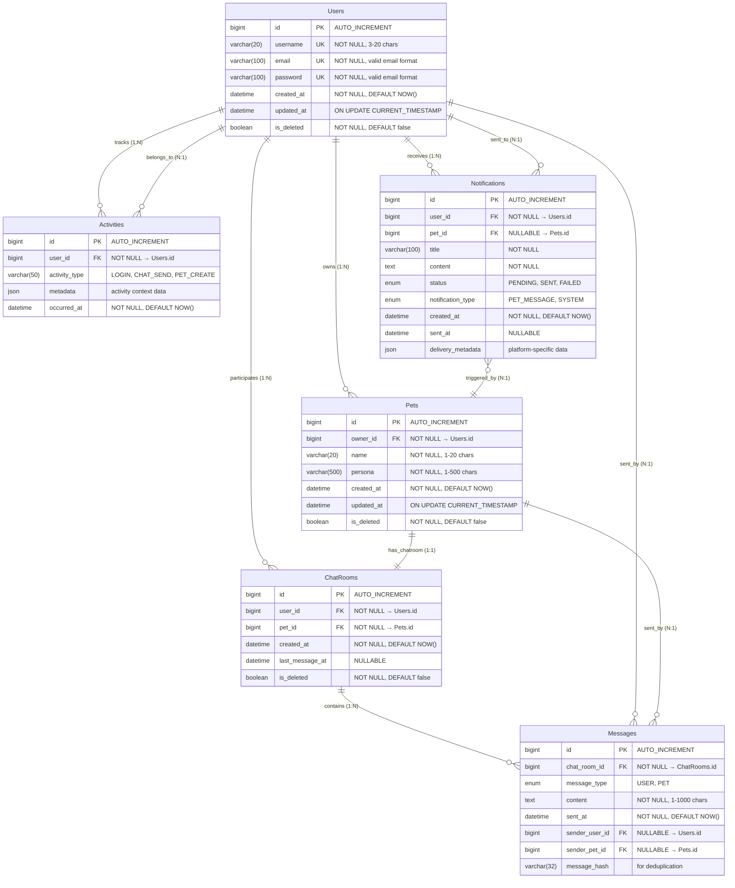

## ERD



## 엔티티 상세 설명

### 1. Users (사용자)
- **목적**: 시스템에 가입한 사용자 정보 관리
- **주요 특징**:
  - 사용자명과 이메일, 비밀번호 유니크 제약조건

### 2. Pets (반려동물)
- **목적**: 사용자가 생성한 AI 반려동물 정보 관리
- **주요 특징**:
  - 각 반려동물은 한 명의 소유자에 속함
  - 페르소나는 반려동물의 성격과 대화 스타일 정의

### 3. ChatRooms (채팅방)
- **목적**: 사용자와 반려동물 간의 채팅 세션 관리
- **주요 특징**:
  - 사용자와 반려동물 간 1:1 대응
  - 마지막 메시지 시간 추적

### 4. Messages (메시지)
- **목적**: 채팅방 내 모든 메시지 저장
- **주요 특징**:
  - 사용자 또는 반려동물이 발송 (다형성 설계)
  - 메시지 타입으로 발송자 구분
  - 중복 방지를 위한 해시값 저장

### 5. Activities (활동)
- **목적**: 사용자 활동 추적 및 분석
- **주요 특징**:
  - 로그인, 채팅, 반려동물 생성 등 모든 활동 기록
  - JSON 메타데이터로 확장 가능한 컨텍스트 정보

### 6. Notifications (알림)
- **목적**: 사용자 알림 관리 시스템
- **주요 특징**:
  - 반려동물이 트리거하는 알림
  - 발송 상태 추적 (대기, 발송완료, 실패)
  - 플랫폼별 메타데이터 지원

## 비즈니스 규칙

### 사용자-반려동물 관계
- 사용자는 여러 마리의 반려동물을 소유할 수 있음 (1:N)
- 각 반려동물은 정확히 한 명의 소유자에게 속함

### 채팅 시스템
- 각 반려동물마다 정확히 하나의 채팅방 생성 (1:1)
- 사용자는 소유한 반려동물 수만큼 채팅방 보유 (1:N)
- 메시지는 사용자 또는 반려동물이 발송

### 알림 시스템
- 마지막 접속 후 2시간이 지난 사용자에게 반려동물이 메시지 발송
- 반려동물의 메시지는 이전 대화와 페르소나를 기반으로 생성
- 알림 발송 상태를 추적하여 재발송 방지


## 인덱스

```sql
-- 핵심 비즈니스 로직 인덱스
CREATE INDEX idx_users_email ON Users(email);
CREATE INDEX idx_users_username ON Users(username);
CREATE INDEX idx_pets_owner_status ON Pets(owner_id, status);
CREATE INDEX idx_chatrooms_user_pet ON ChatRooms(user_id, pet_id);
CREATE INDEX idx_messages_chatroom_sent_at ON Messages(chat_room_id, sent_at DESC);
CREATE INDEX idx_activities_user_occurred ON Activities(user_id, occurred_at DESC);
CREATE INDEX idx_notifications_user_status ON Notifications(user_id, status, created_at DESC);

-- 소프트 삭제 최적화
CREATE INDEX idx_users_active ON Users(is_deleted) WHERE is_deleted = false;
CREATE INDEX idx_pets_active ON Pets(status) WHERE status = 'ACTIVE';
```

## 확장성 고려사항

### 수평 파티셔닝 전략

```sql
-- 메시지 테이블 월별 파티셔닝
CREATE TABLE Messages_2024_01 PARTITION OF Messages 
    FOR VALUES FROM ('2024-01-01') TO ('2024-02-01');

-- 활동 테이블 주별 파티셔닝
CREATE TABLE Activities_2024_W01 PARTITION OF Activities 
    FOR VALUES FROM ('2024-01-01') TO ('2024-01-08');
```

### 데이터 아카이빙 전략

```sql
-- 오래된 메시지 아카이빙 (1년 이상)
CREATE TABLE Messages_Archive AS SELECT * FROM Messages 
    WHERE sent_at < DATE_SUB(NOW(), INTERVAL 1 YEAR);

-- 비활성 채팅방 아카이빙
CREATE TABLE ChatRooms_Archive AS SELECT * FROM ChatRooms 
    WHERE last_message_at < DATE_SUB(NOW(), INTERVAL 6 MONTH);
```