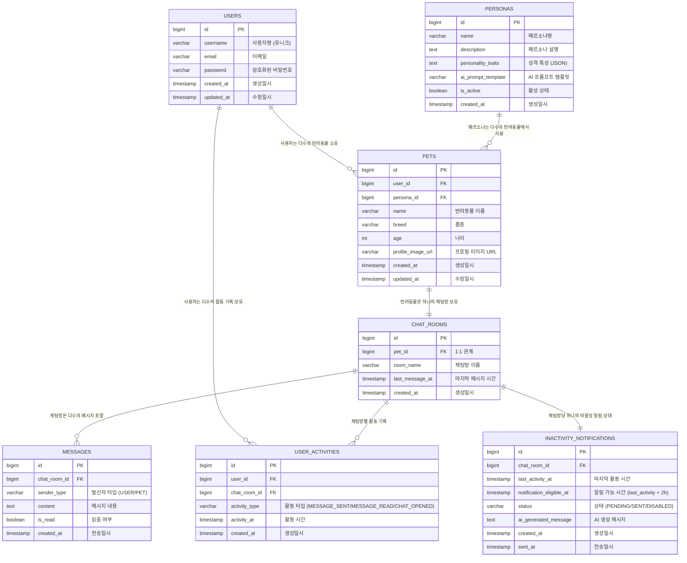

# Puppy Talk Server ERD 설계

## 엔티티 관계 다이어그램



## 테이블 상세 설계

### 1. USERS (사용자)

```sql
CREATE TABLE users (
    id BIGINT AUTO_INCREMENT PRIMARY KEY,
    username VARCHAR(50) NOT NULL UNIQUE,
    email VARCHAR(100) NOT NULL UNIQUE,
    password VARCHAR(255) NOT NULL,
    created_at TIMESTAMP DEFAULT CURRENT_TIMESTAMP,
    updated_at TIMESTAMP DEFAULT CURRENT_TIMESTAMP ON UPDATE CURRENT_TIMESTAMP,
    
    INDEX idx_username (username),
    INDEX idx_email (email)
);
```

### 2. PERSONAS (페르소나)

```sql
CREATE TABLE personas (
    id BIGINT AUTO_INCREMENT PRIMARY KEY,
    name VARCHAR(50) NOT NULL,
    description TEXT,
    personality_traits JSON,
    ai_prompt_template TEXT NOT NULL,
    is_active BOOLEAN DEFAULT true,
    created_at TIMESTAMP DEFAULT CURRENT_TIMESTAMP,
    
    INDEX idx_active (is_active)
);
```

### 3. PETS (반려동물)

```sql
CREATE TABLE pets (
    id BIGINT AUTO_INCREMENT PRIMARY KEY,
    user_id BIGINT NOT NULL,
    persona_id BIGINT NOT NULL,
    name VARCHAR(50) NOT NULL,
    breed VARCHAR(50),
    age INT,
    profile_image_url VARCHAR(500),
    created_at TIMESTAMP DEFAULT CURRENT_TIMESTAMP,
    updated_at TIMESTAMP DEFAULT CURRENT_TIMESTAMP ON UPDATE CURRENT_TIMESTAMP,
    
    FOREIGN KEY (user_id) REFERENCES users(id) ON DELETE CASCADE,
    FOREIGN KEY (persona_id) REFERENCES personas(id) ON DELETE RESTRICT,
    INDEX idx_user_id (user_id),
    INDEX idx_persona_id (persona_id)
);
```

### 4. CHAT_ROOMS (채팅방)

```sql
CREATE TABLE chat_rooms (
    id BIGINT AUTO_INCREMENT PRIMARY KEY,
    pet_id BIGINT NOT NULL UNIQUE,
    room_name VARCHAR(100) NOT NULL,
    last_message_at TIMESTAMP,
    created_at TIMESTAMP DEFAULT CURRENT_TIMESTAMP,
    
    FOREIGN KEY (pet_id) REFERENCES pets(id) ON DELETE CASCADE,
    INDEX idx_pet_id (pet_id),
    INDEX idx_last_message_at (last_message_at)
);
```

### 5. MESSAGES (메시지)

```sql
CREATE TABLE messages (
    id BIGINT AUTO_INCREMENT PRIMARY KEY,
    chat_room_id BIGINT NOT NULL,
    sender_type ENUM('USER', 'PET') NOT NULL,
    content TEXT NOT NULL,
    is_read BOOLEAN DEFAULT false,
    created_at TIMESTAMP DEFAULT CURRENT_TIMESTAMP,
    
    FOREIGN KEY (chat_room_id) REFERENCES chat_rooms(id) ON DELETE CASCADE,
    INDEX idx_chat_room_id (chat_room_id),
    INDEX idx_created_at (created_at),
    INDEX idx_sender_type (sender_type)
);
```

### 6. USER_ACTIVITIES (사용자 활동 기록)

```sql
CREATE TABLE user_activities (
    id BIGINT AUTO_INCREMENT PRIMARY KEY,
    user_id BIGINT NOT NULL,
    chat_room_id BIGINT NOT NULL,
    activity_type ENUM('MESSAGE_SENT', 'MESSAGE_READ', 'CHAT_OPENED') NOT NULL,
    activity_at TIMESTAMP DEFAULT CURRENT_TIMESTAMP,
    created_at TIMESTAMP DEFAULT CURRENT_TIMESTAMP,
    
    FOREIGN KEY (user_id) REFERENCES users(id) ON DELETE CASCADE,
    FOREIGN KEY (chat_room_id) REFERENCES chat_rooms(id) ON DELETE CASCADE,
    INDEX idx_user_id (user_id),
    INDEX idx_chat_room_id (chat_room_id),
    INDEX idx_activity_at (activity_at),
    INDEX idx_activity_type (activity_type)
);
```

### 7. INACTIVITY_NOTIFICATIONS (비활성 알림)

```sql
CREATE TABLE inactivity_notifications (
    id BIGINT AUTO_INCREMENT PRIMARY KEY,
    chat_room_id BIGINT NOT NULL UNIQUE,
    last_activity_at TIMESTAMP NOT NULL,
    notification_eligible_at TIMESTAMP NOT NULL,
    status ENUM('PENDING', 'SENT', 'DISABLED') DEFAULT 'PENDING',
    ai_generated_message TEXT,
    created_at TIMESTAMP DEFAULT CURRENT_TIMESTAMP,
    sent_at TIMESTAMP NULL,
    
    FOREIGN KEY (chat_room_id) REFERENCES chat_rooms(id) ON DELETE CASCADE,
    INDEX idx_chat_room_id (chat_room_id),
    INDEX idx_notification_eligible_at (notification_eligible_at),
    INDEX idx_status (status),
    INDEX idx_last_activity_at (last_activity_at)
);
```

## 비즈니스 규칙 반영

1. **1 Pet = 1 Persona**: pets 테이블의 persona_id 필드로 구현
2. **1 Pet = 1 ChatRoom**: chat_rooms.pet_id UNIQUE 제약으로 구현
3. **1 User = N Pets**: pets.user_id 외래키로 구현
4. **페르소나 수정 불가**: personas.ai_prompt_template 불변성 보장
5. **활동 기반 알림**: 마지막 활동으로부터 2시간 후 알림 발송
    - USER_ACTIVITIES: 모든 사용자 활동 추적 (메시지 전송/읽기/채팅방 열기)
    - INACTIVITY_NOTIFICATIONS: 채팅방별 비활성 상태 관리
6. **1 ChatRoom = 1 InactivityNotification**: 채팅방당 하나의 비활성 알림 상태

## 확장성 고려사항

- **AI 모델 연동**: personas.ai_prompt_template으로 AI 프롬프트 관리
- **이미지 저장**: pets.profile_image_url로 외부 스토리지 연동 준비
- **메시지 타입 확장**: messages.content를 TEXT로 하여 이미지/파일 URL도 저장 가능
- **성능 최적화**: 적절한 인덱스 설계 및 파티셔닝 준비