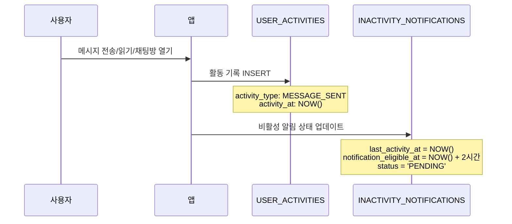
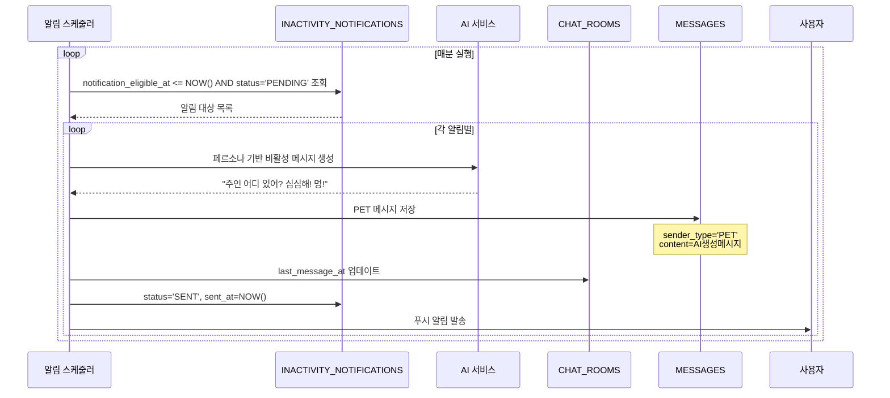

# 비활성 기반 알림 시스템 플로우

## 🔄 새로운 알림 시스템 개요

**변경된 요구사항**: 마지막 활동 시간으로부터 2시간이 지나면 반려동물이 메시지를 보내는 시스템

## 📊 시스템 구성 요소

### 1. USER_ACTIVITIES (활동 추적)

```sql
-- 사용자의 모든 활동을 실시간으로 기록
INSERT INTO user_activities (user_id, chat_room_id, activity_type, activity_at);
```

### 2. INACTIVITY_NOTIFICATIONS (알림 상태 관리)

```sql
-- 각 채팅방별로 하나의 비활성 알림 상태 유지
UPDATE inactivity_notifications
SET last_activity_at         = NOW(),
    notification_eligible_at = DATE_ADD(NOW(), INTERVAL 2 HOUR),
    status                   = 'PENDING';
```

## 🚀 동작 플로우

### **Phase 1: 활동 감지 및 기록**



### **Phase 2: 비활성 모니터링**



## 💻 구현 예시 코드

### **1. 활동 기록 서비스**

```java

@Service
public class UserActivityService {

    @Transactional
    public void recordActivity(Long userId, Long chatRoomId, ActivityType activityType) {
        // 1. 활동 기록 저장
        UserActivity activity = UserActivity.builder()
            .userId(userId)
            .chatRoomId(chatRoomId)
            .activityType(activityType)
            .activityAt(LocalDateTime.now())
            .build();
        userActivityRepository.save(activity);

        // 2. 비활성 알림 상태 업데이트 (UPSERT)
        InactivityNotification notification = inactivityRepository
            .findByChatRoomId(chatRoomId)
            .orElse(InactivityNotification.builder()
                .chatRoomId(chatRoomId)
                .build());

        notification.updateActivity(LocalDateTime.now()); // +2시간 설정
        inactivityRepository.save(notification);
    }
}
```

### **2. 비활성 알림 스케줄러**

```java

@Component
public class InactivityNotificationScheduler {

    @Scheduled(fixedRate = 60000) // 1분마다 실행
    @Transactional
    public void sendInactivityNotifications() {
        LocalDateTime now = LocalDateTime.now();

        // 알림 대상 조회
        List<InactivityNotification> eligibleNotifications =
            inactivityRepository.findEligibleForNotification(now);

        for (InactivityNotification notification : eligibleNotifications) {
            try {
                // 1. AI 메시지 생성
                Pet pet = getPetFromChatRoom(notification.getChatRoomId());
                String aiMessage = aiService.generateInactivityMessage(pet.getPersona());

                // 2. 채팅 메시지 저장
                Message message = Message.builder()
                    .chatRoomId(notification.getChatRoomId())
                    .senderType(SenderType.PET)
                    .content(aiMessage)
                    .isRead(false)
                    .build();
                messageRepository.save(message);

                // 3. 알림 상태 업데이트
                notification.markAsSent(aiMessage, now);
                inactivityRepository.save(notification);

                // 4. 푸시 알림 발송
                pushNotificationService.sendNotification(
                    pet.getUserId(),
                    pet.getName() + "에게서 메시지가 왔어요!"
                );

            } catch (Exception e) {
                notification.markAsFailed();
                log.error("Failed to send inactivity notification", e);
            }
        }
    }
}
```

### **3. 컨트롤러에서 활동 기록**

```java

@RestController
public class ChatController {

    @PostMapping("/api/v1/chat/{chatRoomId}/messages")
    public ResponseEntity<MessageResponse> sendMessage(
        @PathVariable Long chatRoomId,
        @RequestBody SendMessageRequest request,
        Authentication auth) {

        // 메시지 저장
        Message message = chatService.sendMessage(chatRoomId, request.getContent(), auth.getName());

        // 활동 기록 (비동기 처리 권장)
        activityService.recordActivity(
            getCurrentUserId(auth),
            chatRoomId,
            ActivityType.MESSAGE_SENT
        );

        return ResponseEntity.ok(MessageResponse.from(message));
    }

    @PostMapping("/api/v1/chat/{chatRoomId}/read")
    public ResponseEntity<Void> markAsRead(@PathVariable Long chatRoomId, Authentication auth) {
        chatService.markMessagesAsRead(chatRoomId, auth.getName());

        // 읽기 활동 기록
        activityService.recordActivity(
            getCurrentUserId(auth),
            chatRoomId,
            ActivityType.MESSAGE_READ
        );

        return ResponseEntity.ok().build();
    }
}
```

## 🎯 주요 특징

### **1. 실시간 반응형**

- 사용자 활동 즉시 2시간 타이머 리셋
- 활동이 없을 때만 알림 발송

### **2. 효율적인 모니터링**

- `notification_eligible_at` 인덱스로 빠른 조회
- 채팅방별 하나의 알림 상태만 유지

### **3. 개인화된 메시지**

- 각 Pet의 페르소나에 맞는 비활성 메시지 생성
- "주인이 보고 싶어서 먼저 연락" 컨텍스트

### **4. 확장 가능한 활동 추적**

- MESSAGE_SENT, MESSAGE_READ, CHAT_OPENED 외에 추가 활동 타입 확장 가능
- 사용자 행동 분석 데이터로도 활용 가능

이 시스템으로 사용자가 앱을 사용하지 않을 때 자연스럽게 반려동물이 먼저 말을 거는 몰입도 높은 경험을 제공할 수 있습니다!