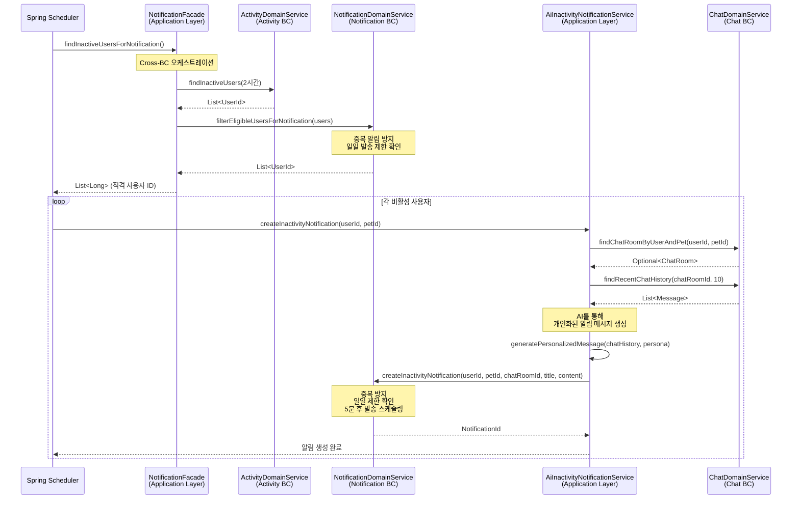
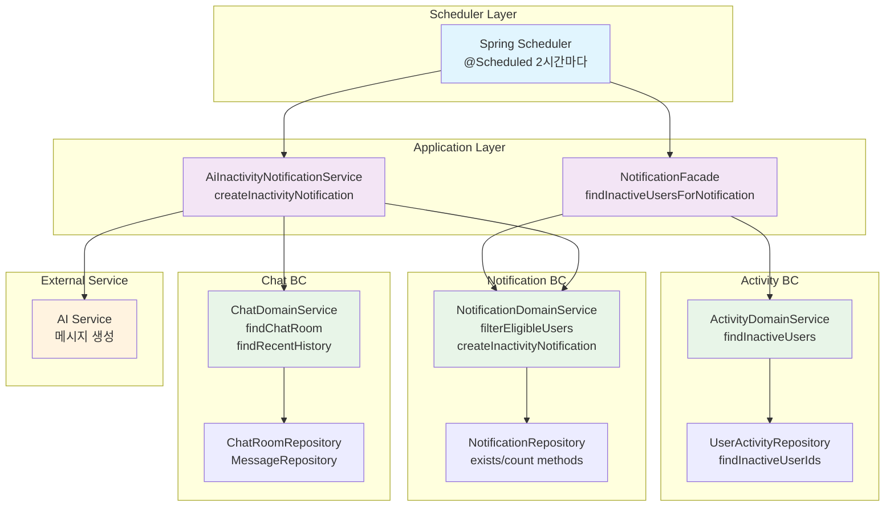
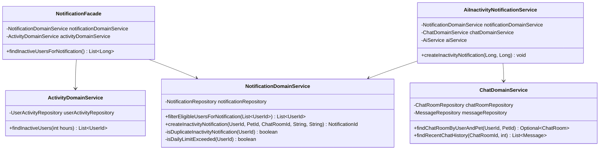
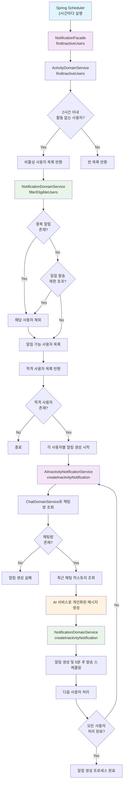
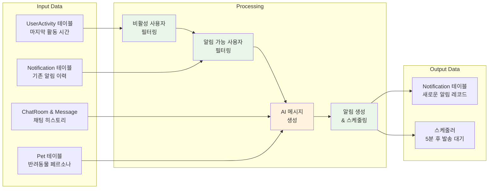

# 비활성 사용자 알림 기능 다이어그램

## 시퀀스 다이어그램

## 아키텍처 다이어그램

## 클래스 다이어그램

## 플로우 차트

## 데이터 플로우

## 핵심 비즈니스 로직

### 1. 비활성 사용자 탐지 (Activity BC)
- **기준**: 마지막 활동 시간이 2시간 이전
- **대상 활동**: 채팅 메시지 전송, 로그인/로그아웃
- **SQL**: `SELECT user_id FROM user_activities WHERE created_at < NOW() - INTERVAL 2 HOUR`

### 2. 알림 대상자 필터링 (Notification BC)
- **중복 방지**: 이미 CREATED/QUEUED 상태의 비활성 알림이 있는 사용자 제외
- **일일 제한**: 하루 5개 이상 알림을 받은 사용자 제외
- **격리 원칙**: 각 BC는 자신의 데이터만 확인

### 3. 개인화된 메시지 생성 (Application Layer)
- **채팅 히스토리**: 최근 10개 메시지 분석
- **반려동물 페르소나**: 개성에 맞는 말투와 내용
- **AI 서비스**: 컨텍스트 기반 자연스러운 메시지 생성

### 4. 알림 스케줄링 (Notification BC)
- **지연 발송**: 생성 후 5분 뒤 실제 발송
- **상태 관리**: CREATED → QUEUED → SENT/FAILED
- **재시도 로직**: 발송 실패 시 자동 재시도
