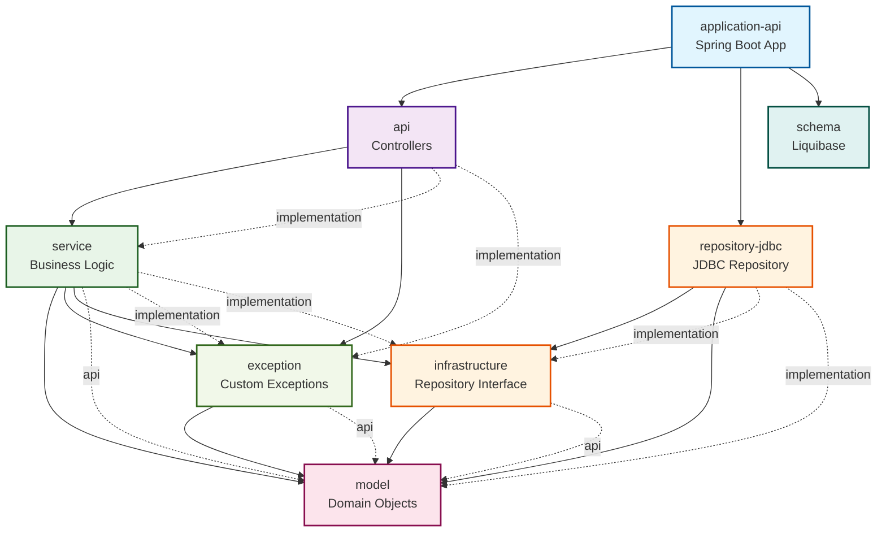

# 모듈 의존 관계

## Mermaid 다이어그램



## 의존 관계 설명

### 계층별 구조

1. **application-api** (메인 애플리케이션)
    - `api`, `repository-jdbc`, `schema` 모듈에 의존
    - Spring Boot 애플리케이션의 진입점

2. **api** (컨트롤러 계층)
    - `service`, `exception` 모듈에 의존
    - REST API 엔드포인트 제공

3. **service** (비즈니스 로직 계층)
    - `model`, `exception`, `infrastructure` 모듈에 의존
    - 핵심 비즈니스 로직 처리

4. **infrastructure** (인프라스트럭처 계층)
    - `model` 모듈에 의존
    - 데이터 접근 추상화

5. **repository-jdbc** (데이터 접근 계층)
    - `infrastructure`, `model` 모듈에 의존
    - JDBC를 통한 데이터베이스 접근

6. **exception** (예외 처리 계층)
    - `model` 모듈에 의존
    - 커스텀 예외 클래스 정의

7. **model** (도메인 모델 계층)
    - 다른 모듈에 의존하지 않음
    - 핵심 도메인 객체 정의

8. **schema** (데이터베이스 스키마)
    - 다른 모듈에 의존하지 않음
    - Liquibase를 통한 데이터베이스 마이그레이션

### 의존성 방향

- 의존성은 **위에서 아래로** 흐름
- **model** 모듈이 최하위 계층으로 모든 계층에서 사용
- **api** → **service** → **infrastructure** → **model** 순서로 의존
- **exception**과 **schema**는 독립적인 모듈로 설계

### 구체적인 의존 관계 (build.gradle 기반)

#### application-api 모듈

```gradle
dependencies {
    implementation project(':api')           // API 계층 의존
    implementation project(':repository-jdbc') // JDBC 리포지토리 의존
    implementation project(':schema')        // 데이터베이스 스키마 의존
}
```

#### api 모듈

```gradle
dependencies {
    implementation project(':service')       // 서비스 계층 의존
    implementation project(':exception')    // 예외 처리 모듈 의존
}
```

#### service 모듈

```gradle
dependencies {
    api project(':model')                   // 모델 모듈 API 의존
    implementation project(':exception')    // 예외 처리 모듈 의존
    implementation project(':infrastructure') // 인프라스트럭처 의존
}
```

#### infrastructure 모듈

```gradle
dependencies {
    api project(':model')                   // 모델 모듈 API 의존
}
```

#### repository-jdbc 모듈

```gradle
dependencies {
    implementation project(':infrastructure') // 인프라스트럭처 의존
    implementation project(':model')         // 모델 모듈 의존
}
```

#### exception 모듈

```gradle
dependencies {
    api project(':model')                   // 모델 모듈 API 의존
}
```

#### model 모듈

```gradle
// 외부 의존성 없음 - 순수 도메인 모델
```

#### schema 모듈

```gradle
dependencies {
    implementation 'org.liquibase:liquibase-core' // Liquibase 의존성만 있음
}
```

### 의존성 유형 설명

- **`api` 의존성**: 다른 모듈에서 해당 모듈의 public API를 사용할 수 있음
- **`implementation` 의존성**: 내부 구현에만 사용되는 의존성
- **외부 라이브러리**: Spring Boot, Liquibase 등 프레임워크 의존성
