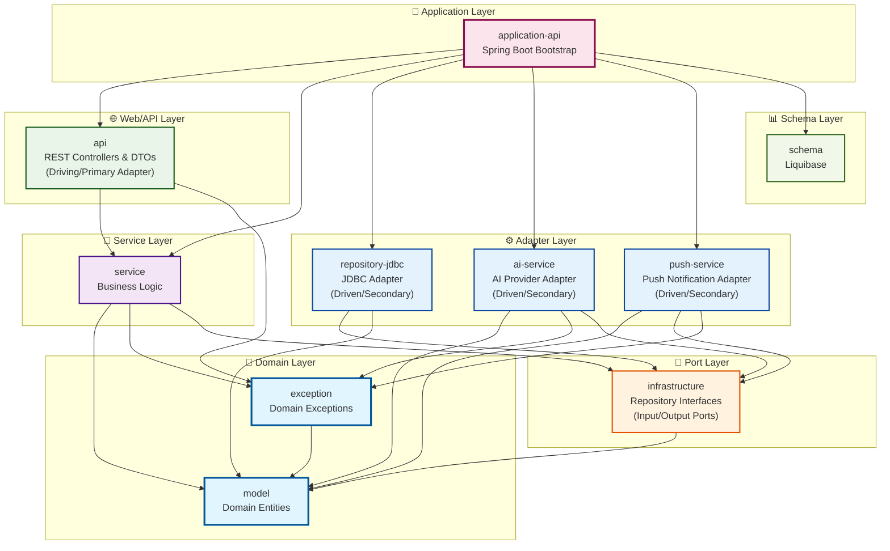
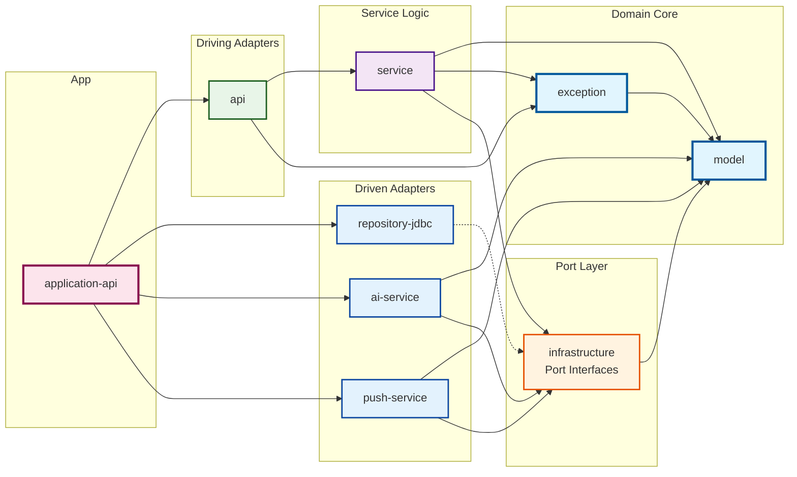

# Puppy Talk Server - 모듈 의존성 다이어그램

## 전체 모듈 의존성 아키텍처

### 레이어별 구조 다이어그램

### 핵심 의존성 흐름

## 모듈별 상세 의존성

### 1. Domain Layer (도메인 계층)

#### model
- **역할**: 순수 도메인 엔티티 정의
- **의존성**: 없음 (외부 라이브러리 의존 금지)
- **포함**: User, Pet, Persona, ChatRoom, Message, UserActivity, etc.

#### exception
- **역할**: 도메인 예외 정의
- **의존성**: `model` (api)
- **포함**: PetNotFoundException, UserNotFoundException, etc.

### 2. Port Layer (포트 계층)

#### infrastructure
- **역할**: Repository 인터페이스(포트) 정의 - Hexagonal Architecture의 핵심
- **의존성**: `model` (api)
- **포함**: UserRepository, PetRepository, MessageRepository 인터페이스
- **설명**: 비즈니스 로직과 외부 시스템 간의 계약을 정의하는 인터페이스

### 3. Service Layer (서비스 계층)

#### service
- **역할**: 비즈니스 로직 구현
- **의존성**: 
  - `model` (api)
  - `exception` (implementation)
  - `infrastructure` (implementation)
  - `ai-service` (testImplementation only)
- **포함**: AuthService, ChatService, PetRegistrationService, etc.

### 4. Adapter Layer (어댑터 계층)

#### Driven Adapters (Secondary/피동 어댑터)

##### repository-jdbc
- **역할**: JDBC 기반 데이터 액세스 구현체 (Driven Adapter)
- **의존성**:
  - `infrastructure` (implementation) - 포트 구현
  - `model` (implementation)
- **포함**: UserJdbcRepository, PetJdbcRepository, etc.

##### ai-service
- **역할**: AI 제공업체 추상화 및 관리 (Driven Adapter)
- **의존성**:
  - `model` (api)
  - `exception` (implementation)
  - `infrastructure` (implementation)
- **포함**: OpenAiProvider, ClaudeProvider, GeminiProvider, etc.

##### push-service
- **역할**: 푸시 알림 서비스 (Driven Adapter)
- **의존성**:
  - `model` (api)
  - `infrastructure` (api)
  - `exception` (implementation)
- **포함**: FcmPushNotificationSender, FirebaseConfig

#### Driving Adapters (Primary/주도 어댑터)

##### api
- **역할**: REST API 컨트롤러 및 DTO (Driving Adapter)
- **의존성**:
  - `service` (implementation)
  - `exception` (implementation)
- **포함**: PetController, ChatController, AuthController, etc.

### 5. Application Layer (애플리케이션 계층)

#### application-api
- **역할**: Spring Boot 애플리케이션 부트스트랩
- **의존성**:
  - `api` (implementation)
  - `service` (implementation) 
  - `ai-service` (implementation)
  - `push-service` (implementation)
  - `repository-jdbc` (implementation)
  - `schema` (api)
- **포함**: PuppyTalkApplication, Configuration 클래스들

### 6. Schema Layer (스키마 계층)

#### schema
- **역할**: 데이터베이스 스키마 관리 (Liquibase)
- **의존성**: 없음 (독립적, 런타임에만 사용됨)
- **포함**: Liquibase 변경 로그 파일들

## 핵심 아키텍처 원칙

### 1. 의존성 역전 (Dependency Inversion)
- Service는 Infrastructure 구현체가 아닌 인터페이스에만 의존
- 예: `ChatService` → `MessageRepository` (인터페이스) ← `MessageJdbcRepository` (구현체)

### 2. 단방향 의존성 (Unidirectional Dependencies)
- 상위 레이어는 하위 레이어를 의존하지만 역방향 금지
- Domain ← Service ← API ← Application

### 3. 순수 도메인 (Clean Domain)
- `model`과 `exception`은 외부 프레임워크 의존성 없음
- 비즈니스 규칙의 순수성 보장

### 4. 포트와 어댑터 (Ports and Adapters)
- `infrastructure`: 포트(인터페이스) 정의
- `repository-jdbc`, `ai-service`, `push-service`: 어댑터(구현체)

## 의존성 타입별 분류

### API Dependencies (타입 노출)
- `exception` → `model`
- `infrastructure` → `model` 
- `service` → `model`
- `ai-service` → `model`
- `push-service` → `model`, `infrastructure`
- `application-api` → `schema`

### Implementation Dependencies (내부 사용만)
- `service` → `exception`, `infrastructure`
- `ai-service` → `exception`, `infrastructure`
- `push-service` → `exception`
- `api` → `service`, `exception`
- `repository-jdbc` → `infrastructure`, `model`
- `application-api` → `api`, `service`, `ai-service`, `push-service`, `repository-jdbc`

### Test Dependencies
- `service` → `ai-service` (testImplementation only)

## 빌드 순서

Gradle의 모듈 의존성에 따른 빌드 순서:

1. **model** (독립적)
2. **schema** (독립적)  
3. **exception** (model 의존)
4. **infrastructure** (model 의존)
5. **ai-service**, **push-service**, **repository-jdbc** (infrastructure 의존)
6. **service** (model, exception, infrastructure 의존)
7. **api** (service, exception 의존)
8. **application-api** (모든 모듈 의존)

이 구조는 Hexagonal Architecture의 핵심 원칙을 따라 비즈니스 로직의 독립성과 테스트 용이성을 보장합니다.