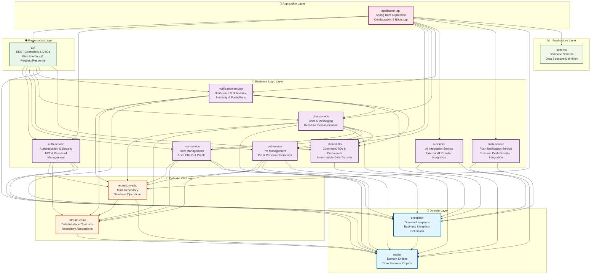
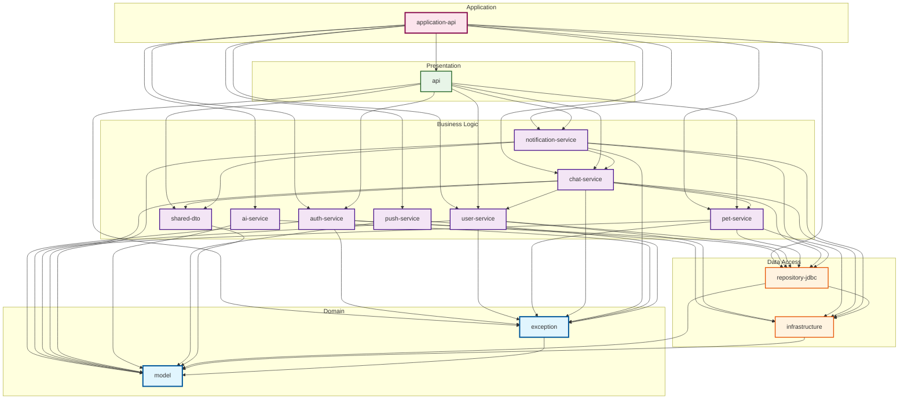

# Puppy Talk Server - 모듈 의존성 다이어그램

## 전체 모듈 의존성 아키텍처 (Layered Architecture)

### 계층형 아키텍처 구조

### 계층형 의존성 흐름 (단방향)

## 모듈별 상세 의존성 (Layered Architecture)

### 1. Domain Layer (도메인 계층) - 최하위 계층

#### model
- **역할**: 순수 도메인 엔티티 정의
- **의존성**: 없음 (외부 라이브러리 의존 금지)
- **포함**: User, Pet, Persona, ChatRoom, Message, UserActivity, etc.
- **특징**: 모든 계층에서 사용되는 핵심 비즈니스 객체

#### exception
- **역할**: 도메인 예외 정의
- **의존성**: `model` (api)
- **포함**: PetNotFoundException, UserNotFoundException, etc.
- **특징**: 비즈니스 규칙 위반 시 발생하는 예외

### 2. Data Access Layer (데이터 접근 계층)

#### infrastructure
- **역할**: 데이터 접근 인터페이스 정의
- **의존성**: `model` (api)
- **포함**: UserRepository, PetRepository, MessageRepository 인터페이스
- **특징**: 비즈니스 로직과 데이터 저장소 간의 계약 정의

#### repository-jdbc
- **역할**: JDBC 기반 데이터 액세스 구현체
- **의존성**:
  - `infrastructure` (implementation) - 인터페이스 구현
  - `model` (implementation)
- **포함**: UserJdbcRepository, PetJdbcRepository, etc.
- **특징**: 실제 데이터베이스 조작 담당

### 3. Business Logic Layer (비즈니스 로직 계층)

#### auth-service
- **역할**: 인증 및 보안 관리
- **의존성**: 
  - `model` (api)
  - `exception` (implementation)
  - `infrastructure` (implementation)
  - `repository-jdbc` (implementation)
- **포함**: AuthService, JwtTokenProvider, PasswordEncoder
- **특징**: JWT 토큰 관리 및 비밀번호 해싱

#### user-service
- **역할**: 사용자 관리
- **의존성**: 
  - `model` (api)
  - `exception` (implementation)
  - `infrastructure` (implementation)
  - `repository-jdbc` (implementation)
- **포함**: UserLookUpService, UserManagementService
- **특징**: 사용자 CRUD 및 프로필 관리

#### pet-service
- **역할**: 반려동물 및 페르소나 관리
- **의존성**: 
  - `model` (api)
  - `exception` (implementation)
  - `infrastructure` (implementation)
  - `repository-jdbc` (implementation)
- **포함**: PetRegistrationService, PetLookUpService, PersonaLookUpService
- **특징**: 1Pet = 1Persona 비즈니스 규칙 관리

#### chat-service
- **역할**: 채팅 및 실시간 통신
- **의존성**: 
  - `model` (api)
  - `exception` (implementation)
  - `infrastructure` (implementation)
  - `repository-jdbc` (implementation)
  - `user-service` (implementation)
  - `pet-service` (implementation)
  - `shared-dto` (implementation)
- **포함**: ChatService, WebSocketChatService, ActivityTrackingService
- **특징**: 복합 비즈니스 로직 및 실시간 처리

#### notification-service
- **역할**: 알림 및 스케줄링
- **의존성**: 
  - `model` (api)
  - `exception` (implementation)
  - `infrastructure` (implementation)
  - `repository-jdbc` (implementation)
  - `chat-service` (implementation)
  - `shared-dto` (implementation)
- **포함**: InactivityNotificationService, PushNotificationScheduler
- **특징**: 2시간 비활성 알림 비즈니스 규칙

#### ai-service
- **역할**: AI 제공업체 통합 서비스
- **의존성**:
  - `model` (api)
  - `exception` (implementation)
- **포함**: OpenAiProvider, ClaudeProvider, GeminiProvider, etc.
- **특징**: 외부 AI 서비스와의 통합 담당

#### push-service
- **역할**: 푸시 알림 서비스
- **의존성**:
  - `model` (api)
  - `exception` (implementation)
- **포함**: FcmPushNotificationSender, FirebaseConfig
- **특징**: 외부 푸시 서비스와의 통합 담당

#### shared-dto
- **역할**: 모듈 간 공통 DTO 및 커맨드
- **의존성**:
  - `model` (api)
- **포함**: ChatStartResult, MessageSendResult, MessageSendCommand
- **특징**: 순수 데이터 전달 객체, 외부 의존성 없음

### 4. Presentation Layer (프레젠테이션 계층)

#### api
- **역할**: REST API 컨트롤러 및 DTO
- **의존성**:
  - `service` (implementation) - 비즈니스 로직 호출
  - `exception` (implementation) - 예외 처리
- **포함**: PetController, ChatController, AuthController, etc.
- **특징**: 외부 요청 처리 및 응답 변환

### 5. Application Layer (애플리케이션 계층) - 최상위 계층

#### application-api
- **역할**: Spring Boot 애플리케이션 부트스트랩
- **의존성**:
  - `api` (implementation) - 프레젠테이션 계층
  - `service` (implementation) - 비즈니스 로직 계층
  - `ai-service` (implementation) - 외부 서비스 통합
  - `push-service` (implementation) - 푸시 서비스
  - `repository-jdbc` (implementation) - 데이터 접근 구현체
  - `schema` (api) - 스키마 관리
- **포함**: PuppyTalkApplication, Configuration 클래스들
- **특징**: 전체 애플리케이션 조립 및 구성

### 6. Infrastructure Layer (인프라스트럭처 계층)

#### schema
- **역할**: 데이터베이스 스키마 관리 (Liquibase)
- **의존성**: 없음 (독립적, 런타임에만 사용됨)
- **포함**: Liquibase 변경 로그 파일들
- **특징**: 데이터베이스 구조 정의 및 버전 관리

## 핵심 아키텍처 원칙 (Layered Architecture)

### 1. 계층 분리 (Layer Separation)
- 각 계층은 명확한 책임을 가지며 단일 관심사에 집중
- 계층 간 명확한 경계와 인터페이스 정의

### 2. 단방향 의존성 (Top-down Dependencies)
- 상위 계층만 하위 계층을 의존 (역방향 의존 금지)
- Application → Presentation → Business → Data → Domain

### 3. 의존성 역전 원칙 (Dependency Inversion)
- 상위 계층은 하위 계층의 추상화(인터페이스)에 의존
- 예: `Service` → `Repository Interface` ← `JDBC Repository`

### 4. 계층별 응집도 (Layer Cohesion)
- 같은 계층 내 모듈들은 유사한 책임과 추상화 수준
- Business Logic Layer: service, ai-service, push-service

## 의존성 타입별 분류

### API Dependencies (타입 노출)
- `exception` → `model`
- `infrastructure` → `model` 
- `service` → `model`
- `ai-service` → `model`
- `push-service` → `model`, `infrastructure`
- `application-api` → `schema`

### Implementation Dependencies (내부 사용만)
- `service` → `exception`, `infrastructure`
- `ai-service` → `exception`, `infrastructure`
- `push-service` → `exception`
- `api` → `service`, `exception`
- `repository-jdbc` → `infrastructure`, `model`
- `application-api` → `api`, `service`, `ai-service`, `push-service`, `repository-jdbc`

### Test Dependencies
- `service` → `ai-service` (testImplementation only)

## 빌드 순서

Gradle의 모듈 의존성에 따른 빌드 순서:

1. **model** (독립적)
2. **schema** (독립적)  
3. **exception** (model 의존)
4. **infrastructure** (model 의존)
5. **ai-service**, **push-service**, **repository-jdbc** (infrastructure 의존)
6. **service** (model, exception, infrastructure 의존)
7. **api** (service, exception 의존)
8. **application-api** (모든 모듈 의존)

이 구조는 Hexagonal Architecture의 핵심 원칙을 따라 비즈니스 로직의 독립성과 테스트 용이성을 보장합니다.