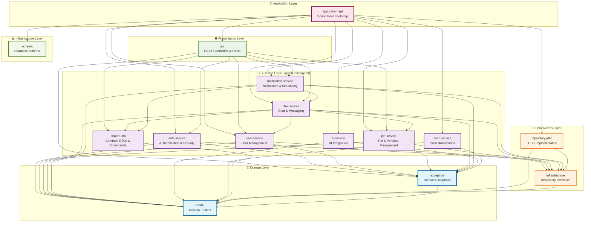

# 새로운 모듈 의존성 매핑

## 📊 모듈 의존성 상세 분석

### 1. 전체 모듈 의존성 다이어그램



### 2. 모듈별 build.gradle 의존성 정의

#### 🔐 auth-service/build.gradle
```gradle
plugins {
    id 'java-library'
}

dependencies {
    api project(':model')
    implementation project(':exception')
    implementation project(':infrastructure')
    implementation project(':repository-jdbc')
    
    // Spring Framework
    implementation 'org.springframework:spring-context'
    implementation 'org.springframework:spring-tx'
    implementation 'org.springframework.boot:spring-boot-autoconfigure'
    
    // JWT (without Spring Security)
    implementation 'io.jsonwebtoken:jjwt-api:0.12.3'
    implementation 'io.jsonwebtoken:jjwt-impl:0.12.3'
    implementation 'io.jsonwebtoken:jjwt-jackson:0.12.3'
    
    // BCrypt for password hashing
    implementation 'at.favre.lib:bcrypt:0.10.2'
    
    // Testing
    testImplementation 'org.springframework.boot:spring-boot-starter-test'
}
```

#### 👤 user-service/build.gradle
```gradle
plugins {
    id 'java-library'
}

dependencies {
    api project(':model')
    implementation project(':exception')
    implementation project(':infrastructure')
    implementation project(':repository-jdbc')
    
    // Spring Framework
    implementation 'org.springframework:spring-context'
    implementation 'org.springframework:spring-tx'
    implementation 'org.springframework.boot:spring-boot-autoconfigure'
    
    // Testing
    testImplementation 'org.springframework.boot:spring-boot-starter-test'
}
```

#### 🐕 pet-service/build.gradle
```gradle
plugins {
    id 'java-library'
}

dependencies {
    api project(':model')
    implementation project(':exception')
    implementation project(':infrastructure')
    implementation project(':repository-jdbc')
    
    // Spring Framework
    implementation 'org.springframework:spring-context'
    implementation 'org.springframework:spring-tx'
    implementation 'org.springframework.boot:spring-boot-autoconfigure'
    
    // Testing
    testImplementation 'org.springframework.boot:spring-boot-starter-test'
}
```

#### 💬 chat-service/build.gradle
```gradle
plugins {
    id 'java-library'
}

dependencies {
    api project(':model')
    implementation project(':exception')
    implementation project(':infrastructure')
    implementation project(':repository-jdbc')
    implementation project(':user-service')
    implementation project(':pet-service')
    implementation project(':shared-dto')
    
    // Spring Framework
    implementation 'org.springframework:spring-context'
    implementation 'org.springframework:spring-tx'
    implementation 'org.springframework:spring-messaging'
    implementation 'org.springframework.boot:spring-boot-autoconfigure'
    
    // Testing
    testImplementation 'org.springframework.boot:spring-boot-starter-test'
    testImplementation project(':ai-service')  // For integration tests
}
```

#### 📢 notification-service/build.gradle
```gradle
plugins {
    id 'java-library'
}

dependencies {
    api project(':model')
    implementation project(':exception')
    implementation project(':infrastructure')
    implementation project(':repository-jdbc')
    implementation project(':chat-service')
    implementation project(':shared-dto')
    
    // Spring Framework
    implementation 'org.springframework:spring-context'
    implementation 'org.springframework:spring-tx'
    implementation 'org.springframework.boot:spring-boot-autoconfigure'
    
    // Testing
    testImplementation 'org.springframework.boot:spring-boot-starter-test'
}
```

#### 📦 shared-dto/build.gradle
```gradle
plugins {
    id 'java-library'
}

dependencies {
    api project(':model')
    
    // No external dependencies - pure data transfer objects
    
    // Testing
    testImplementation 'org.springframework.boot:spring-boot-starter-test'
}
```

#### 🌐 api/build.gradle (Updated)
```gradle
plugins {
    id 'java-library'
}

dependencies {
    implementation project(':auth-service')
    implementation project(':user-service')
    implementation project(':pet-service')
    implementation project(':chat-service')
    implementation project(':notification-service')
    implementation project(':exception')
    implementation project(':shared-dto')

    // Spring Boot Starters
    implementation 'org.springframework.boot:spring-boot-starter-web'
    implementation 'org.springframework.boot:spring-boot-starter-validation'
    
    // Spring Framework
    implementation 'org.springframework:spring-messaging'
    
    // External Libraries
    implementation 'org.springdoc:springdoc-openapi-starter-webmvc-ui'
    
    // Testing
    testImplementation 'org.springframework.boot:spring-boot-starter-test'
}
```

#### 🚀 application-api/build.gradle (Updated)
```gradle
plugins {
    id 'java-library'
    id 'org.springframework.boot' version '3.4.0'
    id 'io.spring.dependency-management' version '1.1.6'
}

dependencies {
    implementation project(':api')
    implementation project(':auth-service')
    implementation project(':user-service')
    implementation project(':pet-service')
    implementation project(':chat-service')
    implementation project(':notification-service')
    implementation project(':ai-service')
    implementation project(':push-service')
    implementation project(':repository-jdbc')
    api project(':schema')

    implementation 'org.springframework.boot:spring-boot-starter-web'
    implementation 'org.springframework.boot:spring-boot-starter-jdbc'
    implementation 'org.springframework.boot:spring-boot-starter-actuator'
    implementation 'org.springframework.boot:spring-boot-starter-websocket'
    
    // SpringDoc OpenAPI 3 (Swagger)
    implementation 'org.springdoc:springdoc-openapi-starter-webmvc-ui'

    implementation 'org.mariadb.jdbc:mariadb-java-client'
    
    compileOnly 'org.projectlombok:lombok'
    annotationProcessor 'org.projectlombok:lombok'

    testImplementation 'org.springframework.boot:spring-boot-starter-test'
    testImplementation 'com.h2database:h2'
}
```

### 3. 의존성 레벨 분석

#### Level 0 (기반 계층)
- `model` - 도메인 엔티티
- `schema` - 데이터베이스 스키마

#### Level 1 (도메인 계층)
- `exception` → `model`

#### Level 2 (인프라스트럭처 계층)
- `infrastructure` → `model`

#### Level 3 (데이터 접근 계층)
- `repository-jdbc` → `infrastructure`, `model`

#### Level 4 (공통 DTO 계층)
- `shared-dto` → `model`

#### Level 5 (핵심 비즈니스 계층)
- `auth-service` → `model`, `exception`, `infrastructure`, `repository-jdbc`
- `user-service` → `model`, `exception`, `infrastructure`, `repository-jdbc`
- `pet-service` → `model`, `exception`, `infrastructure`, `repository-jdbc`
- `ai-service` → `model`, `exception`
- `push-service` → `model`, `exception`

#### Level 6 (복합 비즈니스 계층)
- `chat-service` → `user-service`, `pet-service`, `shared-dto`, 모든 하위 계층
- `notification-service` → `chat-service`, `shared-dto`, 모든 하위 계층

#### Level 7 (프레젠테이션 계층)
- `api` → 모든 비즈니스 서비스, `exception`, `shared-dto`

#### Level 8 (애플리케이션 계층)
- `application-api` → 모든 모듈

### 4. 순환 의존성 방지 규칙

#### ✅ 허용되는 의존성 방향
```
Level 8 → Level 7 → Level 6 → Level 5 → Level 4
                  ↘         ↘         ↘
                   Level 3 → Level 2 → Level 1 → Level 0
```

#### ❌ 금지되는 의존성 패턴
- **역방향 의존성**: 하위 레벨 → 상위 레벨
- **같은 레벨 간 의존성**: Level 5 서비스 간 직접 의존 금지
  - 예외: `chat-service` ↔ `user-service`, `pet-service` (Level 6이므로 허용)
- **순환 의존성**: A → B → A 형태의 모든 패턴

#### 🔧 의존성 해결 전략
1. **인터페이스 분리**: 필요시 인터페이스를 별도 모듈로 분리
2. **이벤트 기반**: 직접 의존성 대신 이벤트 발행/구독 패턴 사용
3. **공통 모듈**: 공유 데이터는 `shared-dto`나 `model`에 위치

### 5. 테스트 의존성 전략

#### 단위 테스트
- 각 모듈은 자체 테스트만 포함
- Mock 객체를 통한 의존성 격리

#### 통합 테스트
- `application-api` 모듈에서 모듈 간 통합 테스트 실행
- `testImplementation` 의존성을 통한 테스트 전용 의존성 관리

#### 테스트 격리
```gradle
// chat-service에서 AI 서비스 테스트 시에만 의존
testImplementation project(':ai-service')
```

이 의존성 매핑은 **Layered Architecture**의 원칙을 준수하면서도 각 모듈의 독립성을 보장하고, 향후 마이크로서비스 전환 시에도 용이하도록 설계되었습니다.