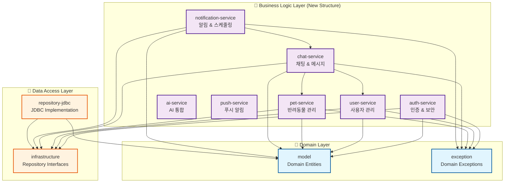

# Service 모듈 기능별 분리 설계

## 📋 현재 Service 모듈 분석

### 현재 구조
```
service/
├── auth/                     # 인증 관련
│   ├── AuthService
│   ├── JwtTokenProvider
│   └── PasswordEncoder
├── chat/                     # 채팅 관련
│   ├── ActivityTrackingService
│   ├── ChatRoomLookUpService
│   ├── ChatService
│   ├── DeviceTokenService
│   ├── MessageLookUpService
│   └── WebSocketChatService
├── pet/                      # 반려동물 관련
│   ├── PersonaLookUpService
│   ├── PetLookUpService
│   └── PetRegistrationService
├── user/                     # 사용자 관련
│   ├── UserLookUpService
├── notification/             # 알림 관련
│   ├── PushNotificationScheduler
│   ├── PushNotificationService
│   └── RealtimeNotificationPort
├── InactivityNotificationScheduler
├── InactivityNotificationService
└── dto/                      # 공통 DTO
    ├── ChatStartResult
    ├── MessageSendResult
    └── PetRegistrationResult
```

## 🎯 기능별 모듈 분리 설계

### 1. 새로운 모듈 구조



### 2. 모듈별 책임과 기능

#### 🔐 auth-service
- **주요 기능**: 인증, 권한 관리, JWT 토큰 처리
- **포함 클래스**:
  - `AuthService`: 로그인, 회원가입, 토큰 검증
  - `JwtTokenProvider`: JWT 토큰 생성/파싱/검증
  - `PasswordEncoder`: 비밀번호 해싱/검증
- **의존성**: `model`, `exception`, `infrastructure`
- **특징**: 보안 관련 모든 기능을 집중 관리

#### 👤 user-service
- **주요 기능**: 사용자 정보 관리, 사용자 조회
- **포함 클래스**:
  - `UserLookUpService`: 사용자 조회 서비스
  - `UserManagementService`: 사용자 정보 수정 (신규)
- **의존성**: `model`, `exception`, `infrastructure`
- **특징**: 사용자 도메인의 CRUD 및 비즈니스 로직

#### 🐕 pet-service
- **주요 기능**: 반려동물 등록, 관리, 페르소나 관리
- **포함 클래스**:
  - `PetRegistrationService`: 반려동물 등록
  - `PetLookUpService`: 반려동물 조회
  - `PersonaLookUpService`: 페르소나 조회
  - `PetManagementService`: 반려동물 정보 관리 (신규)
- **의존성**: `model`, `exception`, `infrastructure`
- **특징**: 1Pet = 1Persona 비즈니스 규칙 관리

#### 💬 chat-service
- **주요 기능**: 채팅방 관리, 메시지 처리, 실시간 통신
- **포함 클래스**:
  - `ChatService`: 채팅 서비스 핵심 로직
  - `ChatRoomLookUpService`: 채팅방 조회
  - `MessageLookUpService`: 메시지 조회
  - `ActivityTrackingService`: 사용자 활동 추적
  - `WebSocketChatService`: WebSocket 실시간 채팅
  - `DeviceTokenService`: 디바이스 토큰 관리
- **의존성**: `model`, `exception`, `infrastructure`, `user-service`, `pet-service`
- **특징**: 실시간 채팅과 활동 추적의 복합 기능

#### 📢 notification-service
- **주요 기능**: 비활성 알림, 스케줄링, 알림 관리
- **포함 클래스**:
  - `InactivityNotificationService`: 비활성 알림 처리
  - `InactivityNotificationScheduler`: 알림 스케줄링
  - `PushNotificationScheduler`: 푸시 알림 스케줄링
  - `PushNotificationService`: 푸시 알림 서비스
  - `RealtimeNotificationPort`: 실시간 알림 포트
- **의존성**: `model`, `exception`, `infrastructure`, `chat-service`
- **특징**: 2시간 비활성 알림 비즈니스 규칙 관리

#### 🤖 ai-service (기존 유지)
- **주요 기능**: AI 제공업체 통합
- **현재 상태**: 이미 분리된 상태로 유지

#### 📱 push-service (기존 유지)
- **주요 기능**: Firebase FCM 푸시 알림
- **현재 상태**: 이미 분리된 상태로 유지

### 3. 공통 요소 관리

#### 📦 shared-dto (신규 모듈)
- **목적**: 모듈 간 공유되는 DTO와 커맨드 객체
- **포함**:
  - `ChatStartResult`
  - `MessageSendResult`
  - `PetRegistrationResult`
  - `MessageSendCommand`
  - `PetCreateCommand`
  - `DeviceTokenRegistrationCommand`
- **의존성**: `model`

### 4. 모듈 간 의존성 규칙

#### 허용되는 의존성
```
chat-service → user-service (사용자 검증)
chat-service → pet-service (반려동물 검증)
notification-service → chat-service (채팅 활동 기반 알림)
```

#### 금지되는 의존성
```
❌ user-service → chat-service
❌ pet-service → chat-service
❌ auth-service → 다른 비즈니스 서비스
❌ 순환 의존성 모든 케이스
```

### 5. 기술적 고려사항

#### 🔧 Spring Configuration
- 각 모듈은 독립적인 `@Configuration` 클래스 보유
- `application-api`에서 모든 모듈의 설정을 조립

#### 🧪 테스트 전략
- 단위 테스트: 각 모듈 내부에서 독립적으로 실행
- 통합 테스트: `application-api`에서 모듈 간 상호작용 테스트
- WebSocket 통합 테스트: `chat-service`에 집중

#### 📈 확장성
- 새로운 기능은 기존 모듈 확장 또는 새 모듈 추가
- 마이크로서비스 전환 시 각 모듈이 독립 서비스로 분리 가능

## 🚀 마이그레이션 계획

### Phase 1: 모듈 구조 생성
1. 새로운 모듈 디렉토리 생성
2. `build.gradle` 파일 구성
3. `settings.gradle` 업데이트

### Phase 2: 코드 이동
1. 클래스별로 적절한 모듈로 이동
2. 패키지 구조 재정리
3. import 문 수정

### Phase 3: 의존성 정리
1. 모듈 간 의존성 설정
2. 순환 의존성 제거
3. 인터페이스 추출 (필요시)

### Phase 4: 테스트 이동 및 수정
1. 테스트 클래스 해당 모듈로 이동
2. 통합 테스트 재구성
3. 모든 테스트 통과 확인

### Phase 5: 문서화 업데이트
1. 아키텍처 다이어그램 업데이트
2. CLAUDE.md 수정
3. 모듈별 README 작성

## 💡 예상 효과

### 장점
- **명확한 책임 분리**: 각 모듈이 단일 도메인에 집중
- **개발 효율성**: 팀별로 독립적인 모듈 개발 가능
- **테스트 용이성**: 모듈별 독립적인 테스트 실행
- **확장성**: 마이크로서비스 전환 준비
- **유지보수**: 기능별 코드 위치 명확화

### 주의사항
- **복잡성 증가**: 모듈 수 증가로 인한 관리 복잡성
- **의존성 관리**: 모듈 간 의존성 설계 중요성
- **성능**: 모듈 간 호출 오버헤드 (미미하지만 고려 필요)

이 설계는 Domain-Driven Design(DDD)의 Bounded Context 개념을 적용하여 각 모듈이 명확한 비즈니스 경계를 가지도록 구성했습니다.