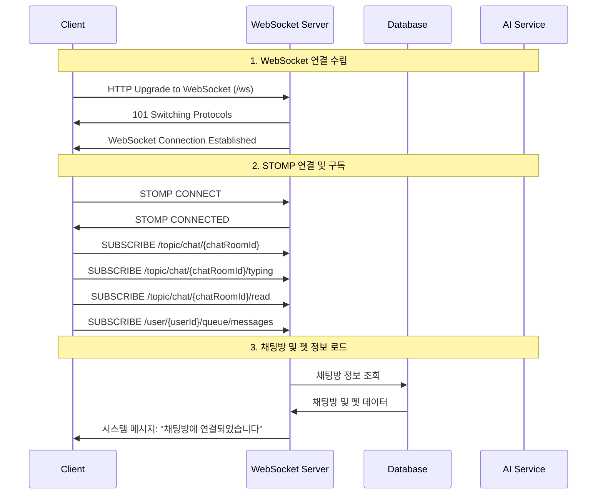
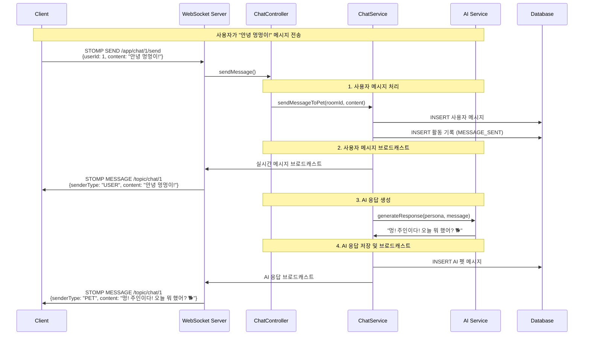
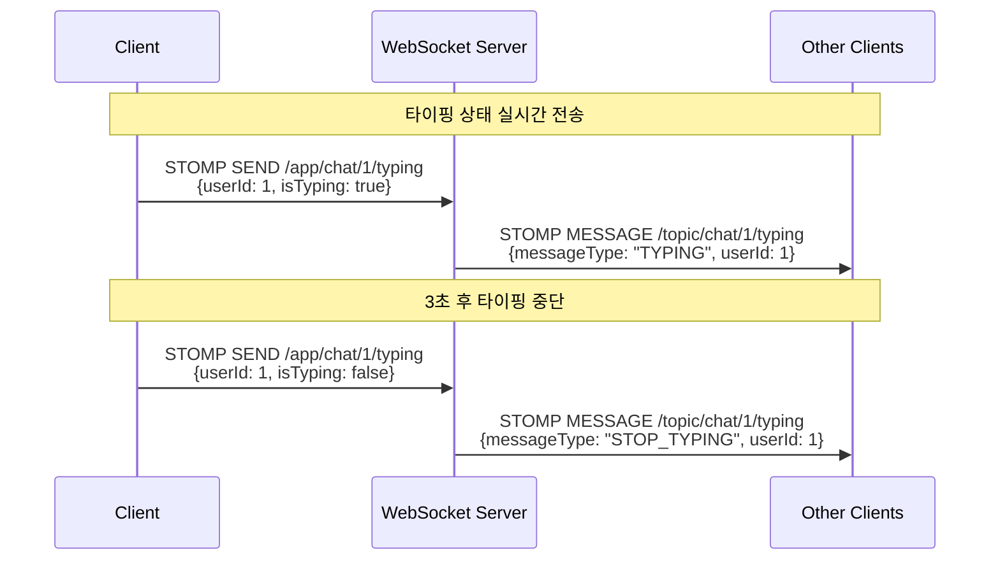
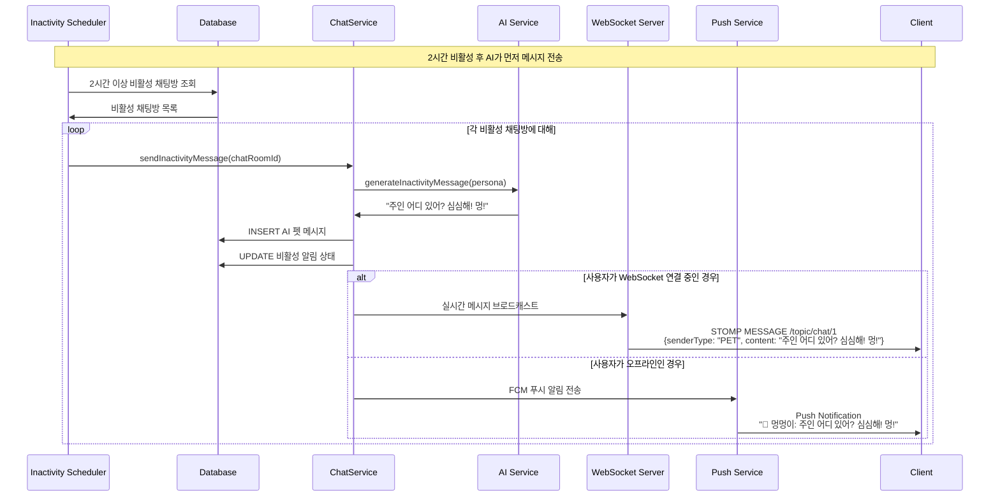
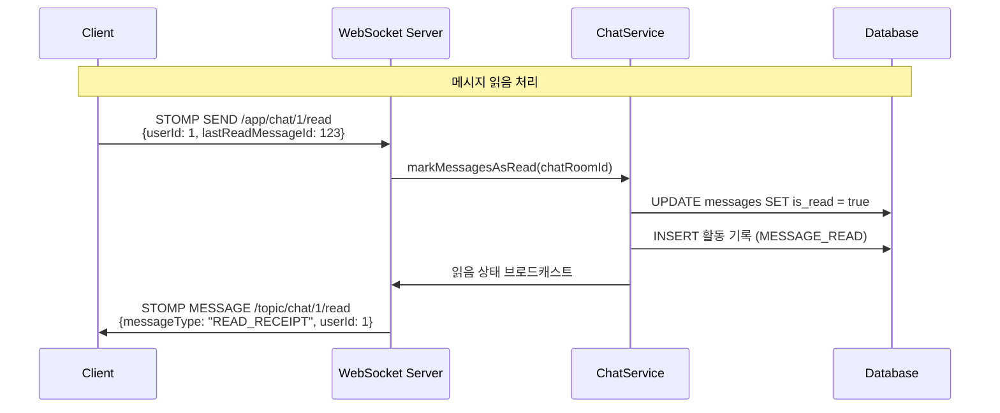
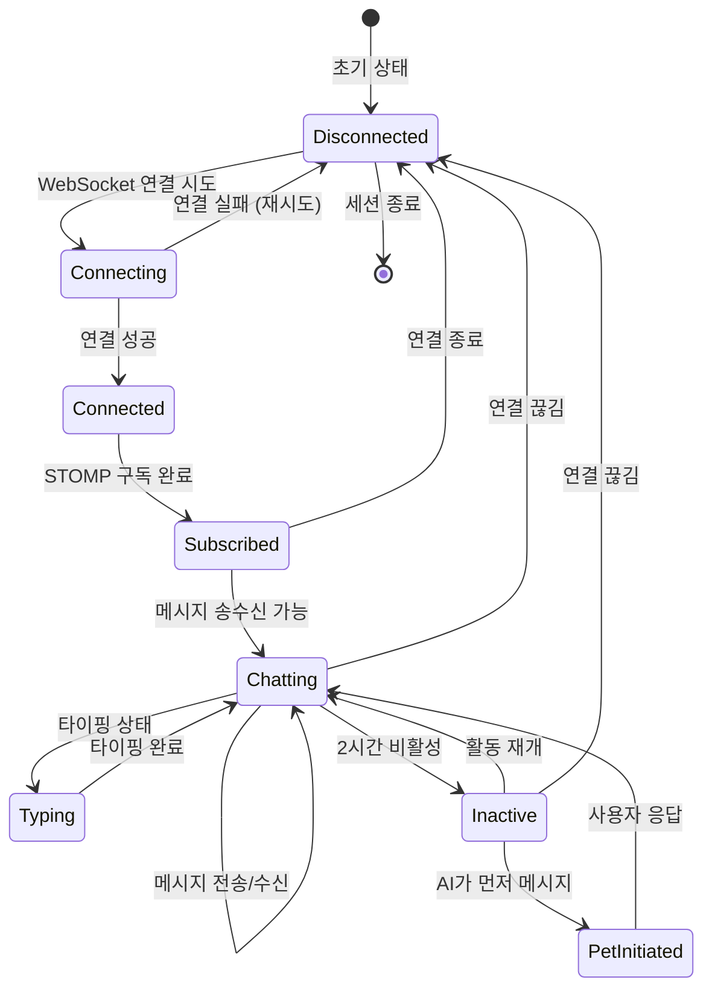
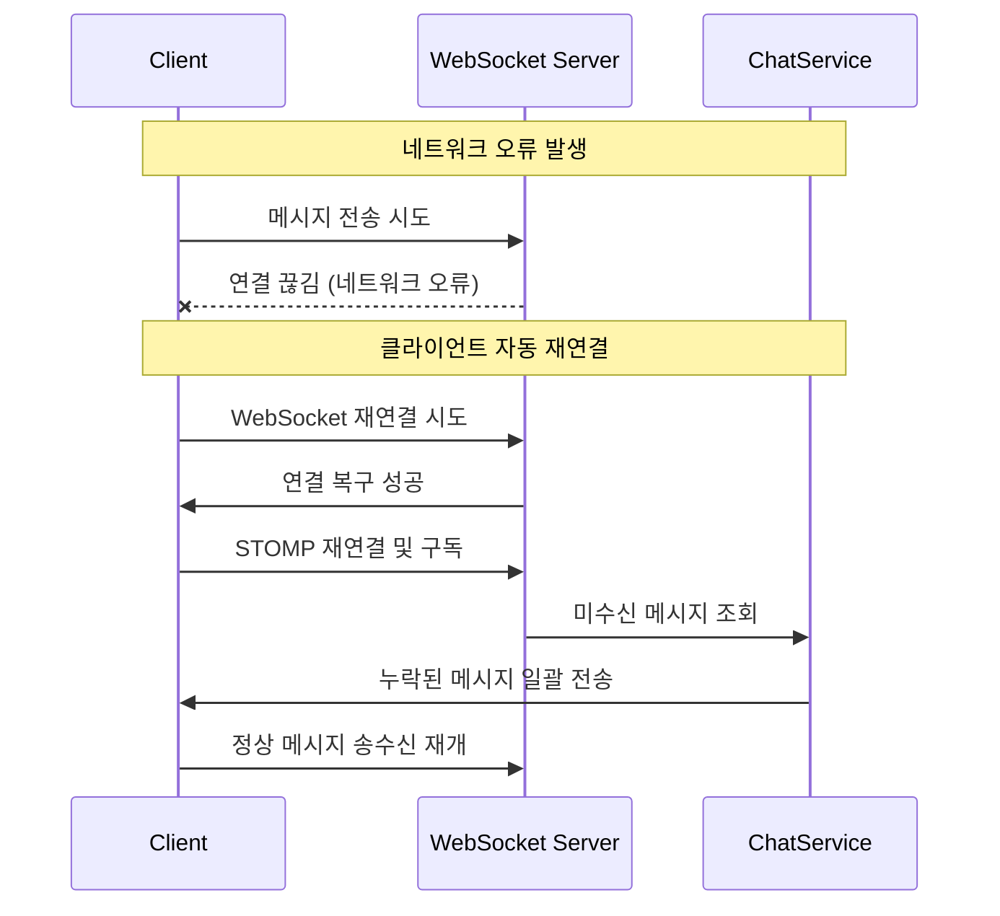

# WebSocket 기반 Puppy Talk 채팅 시스템 다이어그램

## 1. 전체 시스템 아키텍처

```mermaid
graph TB
    subgraph "Client Side"
        UI[웹/모바일 UI]
        WS_CLIENT[WebSocket Client<br/>STOMP.js]
        PUSH_CLIENT[Push Notification<br/>FCM Client]
    end

    subgraph "Server Side"
        WEBSOCKET[WebSocket Handler<br/>STOMP Broker]
        CHAT_CONTROLLER[ChatWebSocketController]
        CHAT_SERVICE[ChatService]
        AI_SERVICE[AI Service<br/>Multi-Provider]
        PUSH_SERVICE[Push Service<br/>FCM]
        SCHEDULER[Inactivity Scheduler]
    end

    subgraph "Storage"
        DB[(Database<br/>Messages, Users, Pets)]
        REDIS[(Redis<br/>Session Management)]
    end

    UI ←→ WS_CLIENT
    UI ←→ PUSH_CLIENT
    WS_CLIENT ←→ WEBSOCKET
    WEBSOCKET ←→ CHAT_CONTROLLER
    CHAT_CONTROLLER ←→ CHAT_SERVICE
    CHAT_SERVICE ←→ AI_SERVICE
    CHAT_SERVICE ←→ PUSH_SERVICE
    CHAT_SERVICE ←→ DB
    SCHEDULER ←→ CHAT_SERVICE
    PUSH_SERVICE ←→ PUSH_CLIENT
```

## 2. WebSocket 연결 및 초기화 과정



## 3. 사용자 메시지 전송 과정



## 4. 타이핑 상태 실시간 전송



## 5. AI 먼저 메시지 보내기 (핵심 기능)



## 6. 읽음 처리 과정



## 7. 연결 상태 관리



## 8. 에러 처리 및 재연결



## 핵심 WebSocket 채널 구조

```
📡 WebSocket Endpoints:
├── /ws                              # WebSocket 연결 엔드포인트
│
📤 Send Destinations (클라이언트 → 서버):
├── /app/chat/{chatRoomId}/send      # 메시지 전송
├── /app/chat/{chatRoomId}/typing    # 타이핑 상태
└── /app/chat/{chatRoomId}/read      # 읽음 처리

📥 Subscribe Destinations (서버 → 클라이언트):
├── /topic/chat/{chatRoomId}         # 채팅 메시지 수신
├── /topic/chat/{chatRoomId}/typing  # 타이핑 상태 수신
├── /topic/chat/{chatRoomId}/read    # 읽음 상태 수신
├── /topic/chat/{chatRoomId}/system  # 시스템 메시지
└── /user/{userId}/queue/messages    # 개인 메시지 (AI 먼저 보내기)
```

## 주요 메시지 타입

```json
// 1. 일반 채팅 메시지
{
  "messageId": {"id": 123},
  "chatRoomId": {"id": 1},
  "userId": {"id": 1},
  "senderType": "USER" | "PET" | "SYSTEM",
  "content": "메시지 내용",
  "isRead": true,
  "timestamp": "2025-01-13T14:30:00",
  "messageType": "MESSAGE"
}

// 2. 타이핑 상태
{
  "chatRoomId": {"id": 1},
  "userId": {"id": 1},
  "senderType": "USER",
  "messageType": "TYPING" | "STOP_TYPING",
  "timestamp": "2025-01-13T14:30:00"
}

// 3. 읽음 확인
{
  "chatRoomId": {"id": 1},
  "userId": {"id": 1},
  "messageType": "READ_RECEIPT",
  "lastReadMessageId": 123,
  "timestamp": "2025-01-13T14:30:00"
}
```

이 다이어그램들이 Puppy Talk의 WebSocket 기반 실시간 채팅 시스템의 전체적인 흐름을 보여줍니다. 특히 "AI가 먼저 메시지 보내기" 기능이 WebSocket의 핵심적인 활용 사례임을 알 수 있습니다.